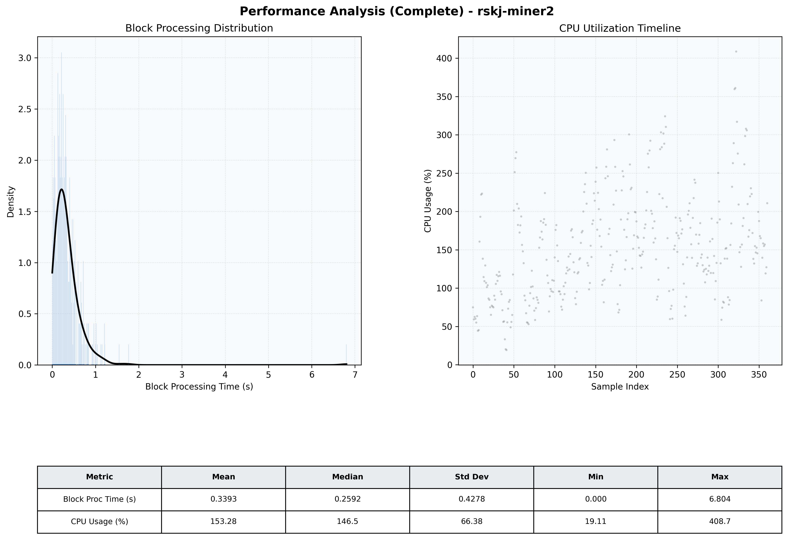

# Miner2 Quantitative Performance Report

| Category | Metric | Unit | Mean | Median | Min | Max |
| :--- | :--- | :--- | :--- | :--- | :--- | :--- |
| Processing | Block Processing Time | s | 0.339 | 0.259 | 0.000 | 6.804 |
|  | BlockExecution JMX | s | 0.183 | 0.120 | 0.004 | 4.314 |
| | Gas Consumed (per block) | M units | 8.09 | 9.23 | 0.00 | 9.97 |
| Resources | CPU Usage per Container | % | 153.28 | 146.46 | 19.11 | 408.74 |
|  | Memory Usage per Container | MiB | 3928.0 | 4015.1 | 3395.2 | 4095.8 |
| | CPU & Memory Assigned | - | 1.0 CPU, 4G | - | - | - |
| JVM | JVM Heap Used | MiB | 1834.0 | 1809.5 | 905.3 | 2791.7 |
| | JVM Heap Allocated | MiB | 2969.6 | 2969.6 | 2969.6 | 2969.6 |
| JVM GC | GC Copy Time | s | 0.0115 | 0.0095 | 0.000 | 0.055 |
| JVM GC | GC MarkSweep Time | s | 0.0016 | 0.0000 | 0.000 | 0.586 |
| Disk I/O | Disk Read | MiB/s | 134.999 | 0.000 | 0.000 | 7073.655 |
|  | Disk Write | MiB/s | 460.597 | 229.624 | 0.000 | 10203.220 |
| Network | Received Network Traffic per Container | KiB/s | 146.14 | 141.39 | 1.57 | 444.61 |
|  | Sent Network Traffic per Container | KiB/s | 150.03 | 146.64 | 1.02 | 486.02 |

