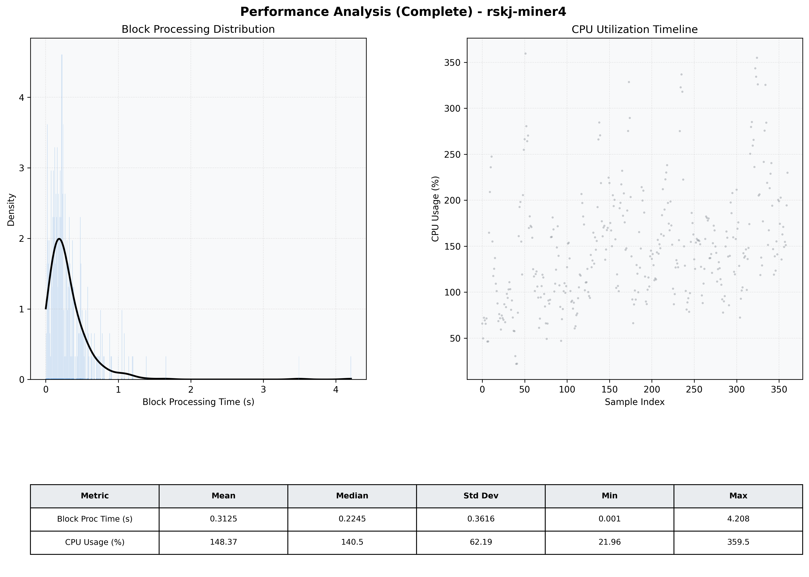

# Miner4 Quantitative Performance Report

| Category | Metric | Unit | Mean | Median | Min | Max |
| :--- | :--- | :--- | :--- | :--- | :--- | :--- |
| Processing | Block Processing Time | s | 0.313 | 0.225 | 0.001 | 4.208 |
|  | BlockExecution JMX | s | 0.223 | 0.129 | 0.005 | 4.534 |
| | Gas Consumed (per block) | M units | 8.09 | 9.23 | 0.00 | 9.97 |
| Resources | CPU Usage per Container | % | 148.37 | 140.50 | 21.96 | 359.50 |
|  | Memory Usage per Container | MiB | 3882.8 | 3963.1 | 3254.5 | 4095.8 |
| | CPU & Memory Assigned | - | 1.0 CPU, 4G | - | - | - |
| JVM | JVM Heap Used | MiB | 1565.6 | 1570.1 | 666.3 | 2501.6 |
| | JVM Heap Allocated | MiB | 2969.6 | 2969.6 | 2969.6 | 2969.6 |
| JVM GC | GC Copy Time | s | 0.0121 | 0.0089 | 0.000 | 0.243 |
| JVM GC | GC MarkSweep Time | s | 0.0011 | 0.0000 | 0.000 | 0.386 |
| Disk I/O | Disk Read | MiB/s | 144.009 | 16.689 | 0.000 | 6359.034 |
|  | Disk Write | MiB/s | 496.181 | 244.915 | 0.000 | 10196.600 |
| Network | Received Network Traffic per Container | KiB/s | 143.81 | 134.28 | 1.55 | 423.33 |
|  | Sent Network Traffic per Container | KiB/s | 152.79 | 144.06 | 10.39 | 522.86 |

