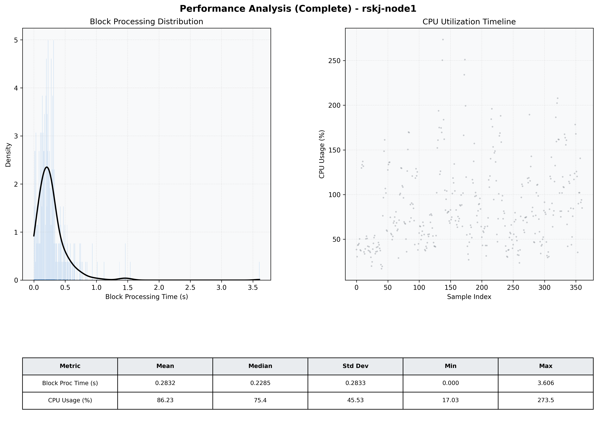

# Node1 Quantitative Performance Report

| Category | Metric | Unit | Mean | Median | Min | Max |
| :--- | :--- | :--- | :--- | :--- | :--- | :--- |
| Processing | Block Processing Time | s | 0.283 | 0.229 | 0.000 | 3.606 |
|  | BlockExecution JMX | s | 0.215 | 0.137 | 0.003 | 4.053 |
| | Gas Consumed (per block) | M units | 8.09 | 9.23 | 0.00 | 9.97 |
| Resources | CPU Usage per Container | % | 86.23 | 75.38 | 17.03 | 273.50 |
|  | Memory Usage per Container | MiB | 3760.5 | 3842.7 | 3121.0 | 4096.0 |
| | CPU & Memory Assigned | - | 1.0 CPU, 4G | - | - | - |
| JVM | JVM Heap Used | MiB | 1897.2 | 1904.2 | 952.4 | 2846.4 |
| | JVM Heap Allocated | MiB | 2969.6 | 2969.6 | 2969.6 | 2969.6 |
| JVM GC | GC Copy Time | s | 0.0081 | 0.0052 | 0.000 | 0.100 |
| JVM GC | GC MarkSweep Time | s | 0.0017 | 0.0000 | 0.000 | 0.611 |
| Disk I/O | Disk Read | MiB/s | 77.159 | 0.000 | 0.000 | 6469.708 |
|  | Disk Write | MiB/s | 235.446 | 32.551 | 1.241 | 9999.379 |
| Network | Received Network Traffic per Container | KiB/s | 167.33 | 160.41 | 1.57 | 656.79 |
|  | Sent Network Traffic per Container | KiB/s | 143.55 | 136.21 | 1.18 | 410.39 |

