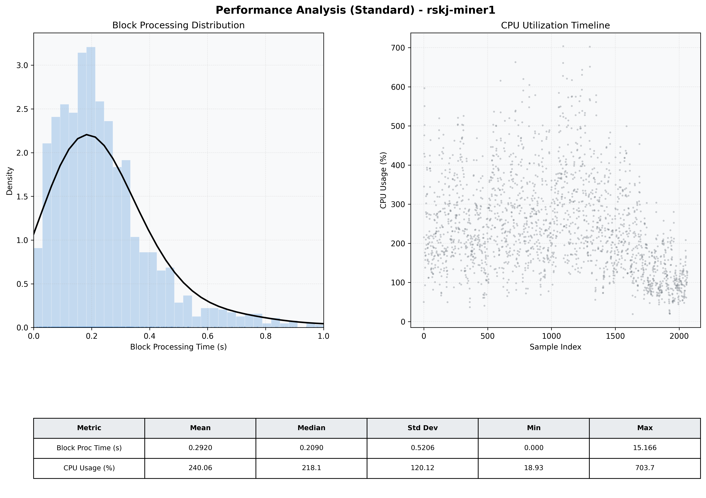

# Miner1 Quantitative Performance Report

| Category | Metric | Unit | Mean | Median | Min | Max |
| :--- | :--- | :--- | :--- | :--- | :--- | :--- |
| Processing | Block Processing Time | s | 0.292 | 0.209 | 0.000 | 15.166 |
|  | BlockExecution JMX | s | 0.156 | 0.119 | 0.004 | 0.993 |
| | Gas Consumed (per block) | M units | 12.89 | 16.07 | 0.00 | 16.96 |
| Resources | CPU Usage per Container | % | 240.06 | 218.12 | 18.93 | 703.65 |
|  | Memory Usage per Container | MiB | 6366.5 | 6280.4 | 3199.2 | 8190.5 |
| | CPU & Memory Assigned | - | 2.0 CPU, 8G | - | - | - |
| JVM | JVM Heap Used | MiB | 1909.1 | 1902.3 | 400.8 | 2736.4 |
| | JVM Heap Allocated | MiB | 3072.0 | 3072.0 | 3072.0 | 3072.0 |
| JVM GC | GC Copy Time | s | N/A | N/A | N/A | N/A |
| JVM GC | GC MarkSweep Time | s | N/A | N/A | N/A | N/A |
| Disk I/O | Disk Read | MiB/s | 67.600 | 1.103 | 0.000 | 9381.783 |
|  | Disk Write | MiB/s | 709.183 | 318.643 | 0.000 | 24790.648 |
| Network | Received Network Traffic per Container | KiB/s | 127.11 | 112.01 | 1.54 | 589.57 |
|  | Sent Network Traffic per Container | KiB/s | 140.40 | 126.14 | 4.67 | 497.32 |

