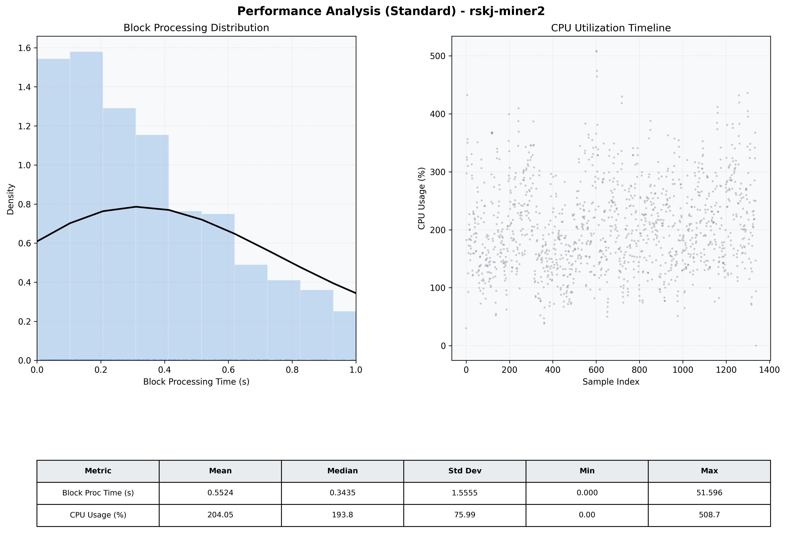

# Miner2 Quantitative Performance Report

| Category | Metric | Unit | Mean | Median | Min | Max |
| :--- | :--- | :--- | :--- | :--- | :--- | :--- |
| Processing | Block Processing Time | s | 0.552 | 0.343 | 0.000 | 51.596 |
|  | BlockExecution JMX | s | 0.248 | 0.179 | 0.010 | 1.000 |
| | Gas Consumed (per block) | M units | 12.89 | 16.07 | 0.00 | 16.96 |
| Resources | CPU Usage per Container | % | 204.05 | 193.85 | 0.00 | 508.67 |
|  | Memory Usage per Container | MiB | 3902.3 | 4050.6 | 1990.3 | 4096.1 |
| | CPU & Memory Assigned | - | 1.0 CPU, 4G | - | - | - |
| JVM | JVM Heap Used | MiB | 1911.6 | 1962.3 | 415.4 | 2854.7 |
| | JVM Heap Allocated | MiB | 2969.6 | 2969.6 | 2969.6 | 2969.6 |
| JVM GC | GC Copy Time | s | 0.0169 | 0.0139 | 0.000 | 0.126 |
| JVM GC | GC MarkSweep Time | s | 0.0009 | 0.0000 | 0.000 | 0.649 |
| Disk I/O | Disk Read | MiB/s | 509.885 | 100.766 | 0.000 | 17363.081 |
|  | Disk Write | MiB/s | 795.749 | 369.172 | 0.000 | 18793.044 |
| Network | Received Network Traffic per Container | KiB/s | 146.19 | 132.11 | 0.00 | 618.54 |
|  | Sent Network Traffic per Container | KiB/s | 161.33 | 149.98 | 0.00 | 576.67 |

