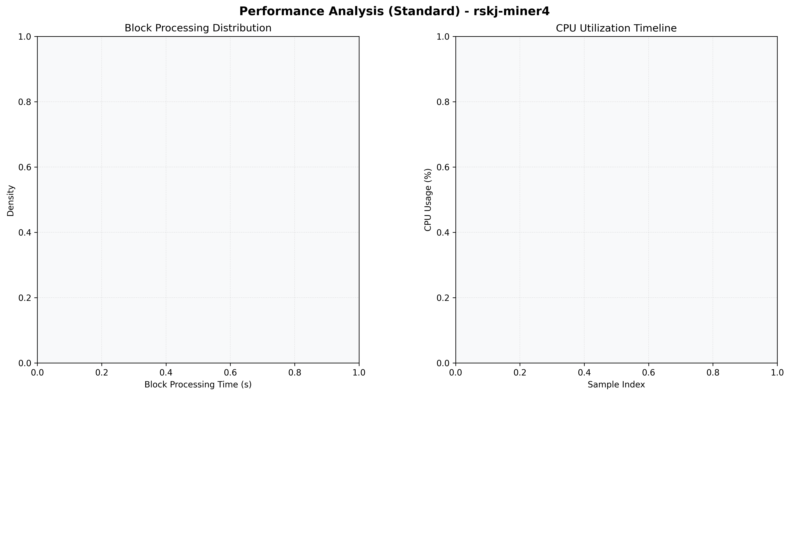

# Miner4 Quantitative Performance Report

| Category | Metric | Unit | Mean | Median | Min | Max |
| :--- | :--- | :--- | :--- | :--- | :--- | :--- |
| Processing | Block Processing Time | s | N/A | N/A | N/A | N/A |
|  | BlockExecution JMX | s | N/A | N/A | N/A | N/A |
| | Gas Consumed (per block) | M units | 12.89 | 16.07 | 0.00 | 16.96 |
| Resources | CPU Usage per Container | % | N/A | N/A | N/A | N/A |
|  | Memory Usage per Container | MiB | N/A | N/A | N/A | N/A |
| | CPU & Memory Assigned | - | 1.0 CPU, 4G | - | - | - |
| JVM | JVM Heap Used | MiB | N/A | N/A | N/A | N/A |
| | JVM Heap Allocated | MiB | N/A | N/A | N/A | N/A |
| JVM GC | GC Copy Time | s | N/A | N/A | N/A | N/A |
| JVM GC | GC MarkSweep Time | s | N/A | N/A | N/A | N/A |
| Disk I/O | Disk Read | MiB/s | N/A | N/A | N/A | N/A |
|  | Disk Write | MiB/s | N/A | N/A | N/A | N/A |
| Network | Received Network Traffic per Container | KiB/s | N/A | N/A | N/A | N/A |
|  | Sent Network Traffic per Container | KiB/s | N/A | N/A | N/A | N/A |

