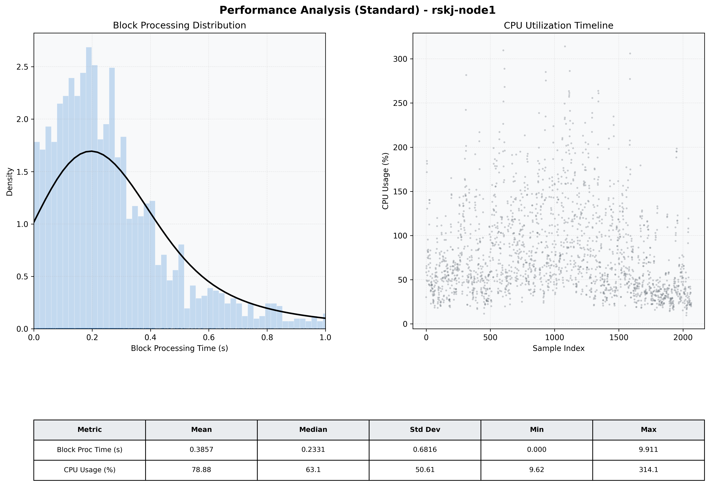

# Node1 Quantitative Performance Report

| Category | Metric | Unit | Mean | Median | Min | Max |
| :--- | :--- | :--- | :--- | :--- | :--- | :--- |
| Processing | Block Processing Time | s | 0.386 | 0.233 | 0.000 | 9.911 |
|  | BlockExecution JMX | s | 0.178 | 0.131 | 0.004 | 0.979 |
| | Gas Consumed (per block) | M units | 12.89 | 16.07 | 0.00 | 16.96 |
| Resources | CPU Usage per Container | % | 78.88 | 63.08 | 9.62 | 314.07 |
|  | Memory Usage per Container | MiB | 3863.6 | 4008.9 | 1951.0 | 4096.0 |
| | CPU & Memory Assigned | - | 1.0 CPU, 4G | - | - | - |
| JVM | JVM Heap Used | MiB | 1909.3 | 1921.6 | 360.3 | 2892.1 |
| | JVM Heap Allocated | MiB | 2969.6 | 2969.6 | 2969.6 | 2969.6 |
| JVM GC | GC Copy Time | s | 0.0101 | 0.0073 | 0.000 | 0.088 |
| JVM GC | GC MarkSweep Time | s | 0.0003 | 0.0000 | 0.000 | 0.531 |
| Disk I/O | Disk Read | MiB/s | 333.707 | 56.534 | 0.000 | 23247.586 |
|  | Disk Write | MiB/s | 435.144 | 40.281 | 0.000 | 26132.414 |
| Network | Received Network Traffic per Container | KiB/s | 148.09 | 132.49 | 1.17 | 511.48 |
|  | Sent Network Traffic per Container | KiB/s | 127.83 | 113.86 | 0.13 | 569.08 |

