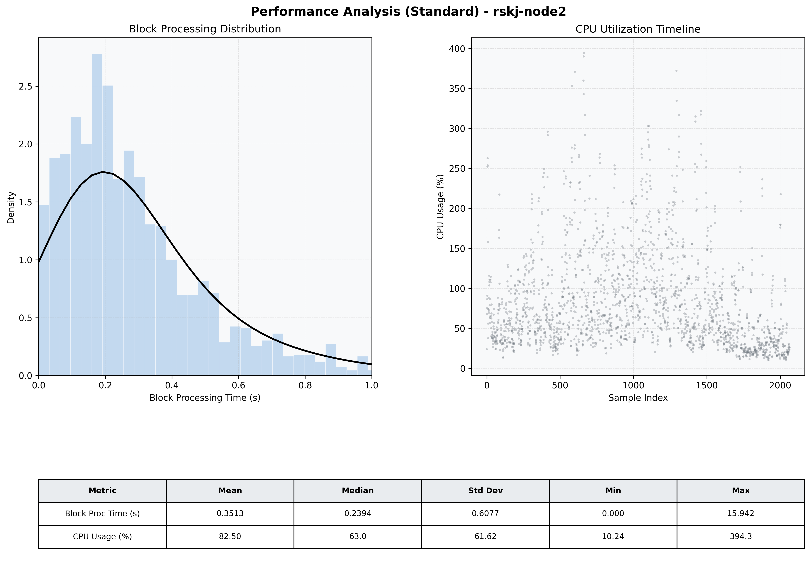

# Node2 Quantitative Performance Report

| Category | Metric | Unit | Mean | Median | Min | Max |
| :--- | :--- | :--- | :--- | :--- | :--- | :--- |
| Processing | Block Processing Time | s | 0.351 | 0.239 | 0.000 | 15.942 |
|  | BlockExecution JMX | s | 0.197 | 0.146 | 0.004 | 0.989 |
| | Gas Consumed (per block) | M units | 12.89 | 16.07 | 0.00 | 16.96 |
| Resources | CPU Usage per Container | % | 82.50 | 62.96 | 10.24 | 394.28 |
|  | Memory Usage per Container | MiB | 4023.0 | 4072.0 | 3051.2 | 4096.0 |
| | CPU & Memory Assigned | - | 2.0 CPU, 4G | - | - | - |
| JVM | JVM Heap Used | MiB | 1653.9 | 1621.2 | 404.5 | 2708.3 |
| | JVM Heap Allocated | MiB | 3072.0 | 3072.0 | 3072.0 | 3072.0 |
| JVM GC | GC Copy Time | s | N/A | N/A | N/A | N/A |
| JVM GC | GC MarkSweep Time | s | N/A | N/A | N/A | N/A |
| Disk I/O | Disk Read | MiB/s | 378.445 | 83.034 | 0.000 | 32231.164 |
|  | Disk Write | MiB/s | 447.460 | 38.210 | 0.000 | 36486.190 |
| Network | Received Network Traffic per Container | KiB/s | 154.61 | 141.11 | 1.21 | 650.83 |
|  | Sent Network Traffic per Container | KiB/s | 102.39 | 90.80 | 4.68 | 457.20 |

