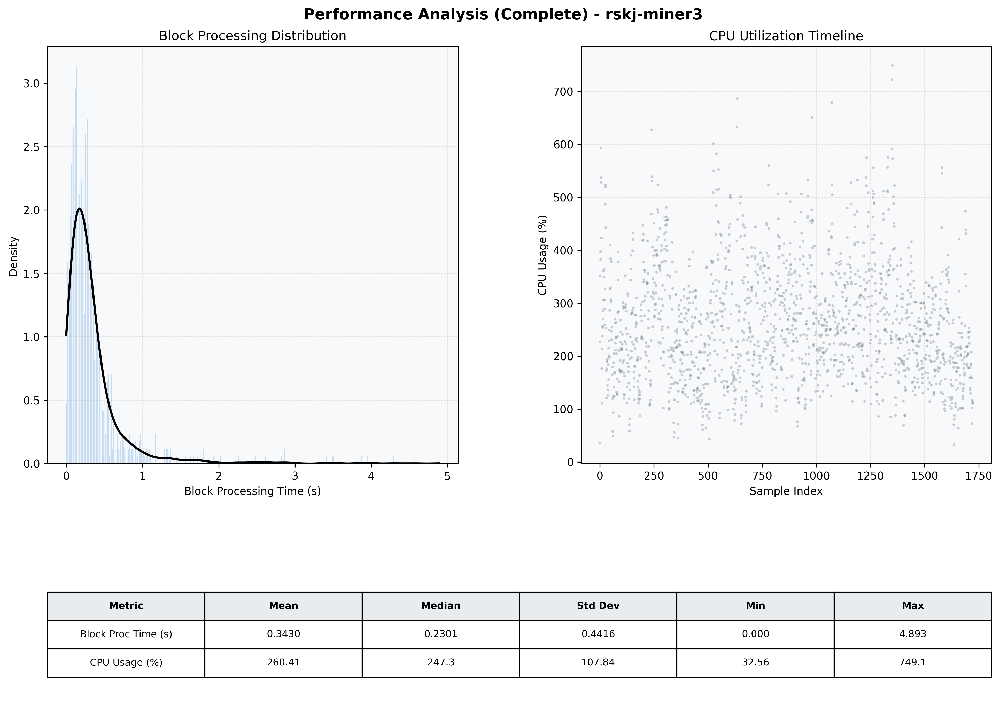

# Miner3 Quantitative Performance Report

| Category | Metric | Unit | Mean | Median | Min | Max |
| :--- | :--- | :--- | :--- | :--- | :--- | :--- |
| Processing | Block Processing Time | s | 0.343 | 0.230 | 0.000 | 4.893 |
|  | BlockExecution JMX | s | 0.230 | 0.139 | 0.007 | 4.698 |
| | Gas Consumed (per block) | M units | 12.89 | 16.07 | 0.00 | 16.96 |
| Resources | CPU Usage per Container | % | 260.41 | 247.26 | 32.56 | 749.14 |
|  | Memory Usage per Container | MiB | 4047.2 | 4073.3 | 3280.0 | 4096.1 |
| | CPU & Memory Assigned | - | 2.0 CPU, 4G | - | - | - |
| JVM | JVM Heap Used | MiB | 1876.6 | 1886.1 | 498.3 | 2739.1 |
| | JVM Heap Allocated | MiB | 3072.0 | 3072.0 | 3072.0 | 3072.0 |
| JVM GC | GC Copy Time | s | N/A | N/A | N/A | N/A |
| JVM GC | GC MarkSweep Time | s | N/A | N/A | N/A | N/A |
| Disk I/O | Disk Read | MiB/s | 625.948 | 141.384 | 0.000 | 25196.400 |
|  | Disk Write | MiB/s | 833.688 | 372.677 | 0.000 | 29728.659 |
| Network | Received Network Traffic per Container | KiB/s | 140.49 | 128.11 | 1.13 | 501.42 |
|  | Sent Network Traffic per Container | KiB/s | 162.39 | 150.73 | 5.22 | 597.64 |

