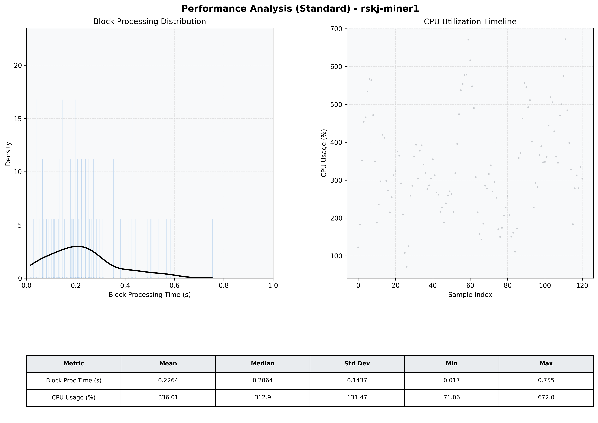

# Miner1 Quantitative Performance Report

| Category | Metric | Unit | Mean | Median | Min | Max |
| :--- | :--- | :--- | :--- | :--- | :--- | :--- |
| Processing | Block Processing Time | s | 0.226 | 0.206 | 0.017 | 0.755 |
|  | BlockExecution JMX | s | 0.123 | 0.106 | 0.013 | 0.464 |
| | Gas Consumed (per block) | M units | 14.32 | 16.27 | 0.34 | 16.94 |
| Resources | CPU Usage per Container | % | 336.01 | 312.93 | 71.06 | 672.05 |
|  | Memory Usage per Container | MiB | 3505.0 | 3550.4 | 1297.8 | 4221.4 |
| | CPU & Memory Assigned | - | 2.0 CPU, 8G | - | - | - |
| JVM | JVM Heap Used | MiB | 1378.5 | 1425.8 | 134.8 | 2632.8 |
| | JVM Heap Allocated | MiB | 3072.0 | 3072.0 | 3072.0 | 3072.0 |
| JVM GC | GC Copy Time | s | N/A | N/A | N/A | N/A |
| JVM GC | GC MarkSweep Time | s | N/A | N/A | N/A | N/A |
| Disk I/O | Disk Read | MiB/s | 0.001 | 0.000 | 0.000 | 0.138 |
|  | Disk Write | MiB/s | 0.001 | 0.001 | 0.000 | 0.006 |
| Network | Received Network Traffic per Container | KiB/s | 311.70 | 280.31 | 3.62 | 901.81 |
|  | Sent Network Traffic per Container | KiB/s | 265.60 | 250.40 | 11.46 | 576.59 |

