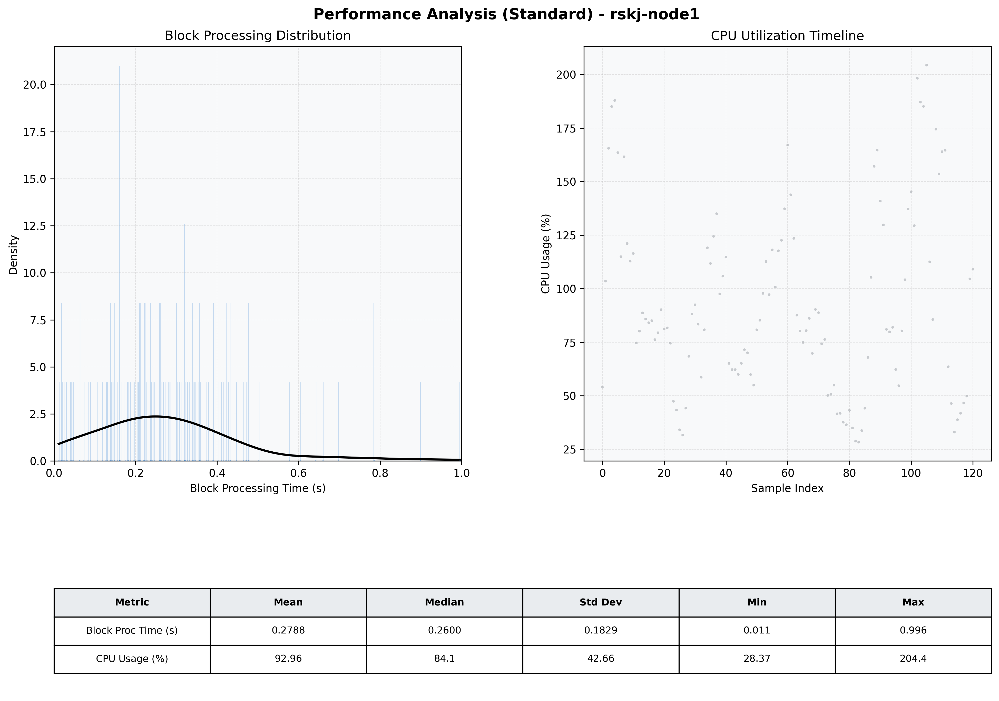

# Node1 Quantitative Performance Report

| Category | Metric | Unit | Mean | Median | Min | Max |
| :--- | :--- | :--- | :--- | :--- | :--- | :--- |
| Processing | Block Processing Time | s | 0.279 | 0.260 | 0.011 | 0.996 |
|  | BlockExecution JMX | s | 0.220 | 0.189 | 0.008 | 0.905 |
| | Gas Consumed (per block) | M units | 14.32 | 16.27 | 0.34 | 16.94 |
| Resources | CPU Usage per Container | % | 92.96 | 84.12 | 28.37 | 204.40 |
|  | Memory Usage per Container | MiB | 2029.6 | 2056.7 | 783.1 | 2550.0 |
| | CPU & Memory Assigned | - | 1.0 CPU, 4G | - | - | - |
| JVM | JVM Heap Used | MiB | 859.5 | 867.0 | 178.9 | 1497.7 |
| | JVM Heap Allocated | MiB | 2969.6 | 2969.6 | 2969.6 | 2969.6 |
| JVM GC | GC Copy Time | s | 0.0068 | 0.0056 | 0.000 | 0.036 |
| JVM GC | GC MarkSweep Time | s | 0.0001 | 0.0000 | 0.000 | 0.007 |
| Disk I/O | Disk Read | MiB/s | 0.001 | 0.000 | 0.000 | 0.138 |
|  | Disk Write | MiB/s | 267.276 | 72.271 | 0.000 | 5869.913 |
| Network | Received Network Traffic per Container | KiB/s | 358.01 | 329.11 | 5.38 | 829.66 |
|  | Sent Network Traffic per Container | KiB/s | 281.95 | 245.77 | 13.45 | 693.69 |

