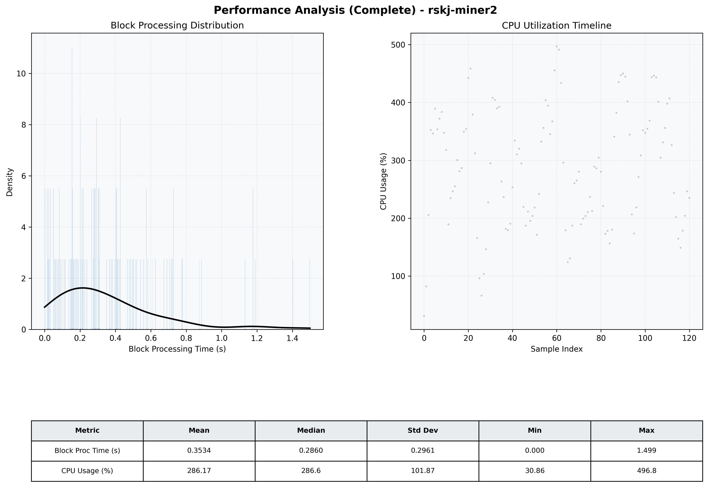

# Miner2 Quantitative Performance Report

| Category | Metric | Unit | Mean | Median | Min | Max |
| :--- | :--- | :--- | :--- | :--- | :--- | :--- |
| Processing | Block Processing Time | s | 0.353 | 0.286 | 0.000 | 1.499 |
|  | BlockExecution JMX | s | 0.184 | 0.148 | 0.012 | 0.997 |
| | Gas Consumed (per block) | M units | 14.32 | 16.27 | 0.34 | 16.94 |
| Resources | CPU Usage per Container | % | 286.17 | 286.58 | 30.86 | 496.77 |
|  | Memory Usage per Container | MiB | 2367.7 | 2421.1 | 1005.9 | 3183.6 |
| | CPU & Memory Assigned | - | 1.0 CPU, 4G | - | - | - |
| JVM | JVM Heap Used | MiB | 918.3 | 942.1 | 114.7 | 1680.1 |
| | JVM Heap Allocated | MiB | 2969.6 | 2969.6 | 2969.6 | 2969.6 |
| JVM GC | GC Copy Time | s | 0.0115 | 0.0112 | 0.000 | 0.029 |
| JVM GC | GC MarkSweep Time | s | 0.0001 | 0.0000 | 0.000 | 0.008 |
| Disk I/O | Disk Read | MiB/s | 0.010 | 0.000 | 0.000 | 0.690 |
|  | Disk Write | MiB/s | 0.001 | 0.001 | 0.000 | 0.006 |
| Network | Received Network Traffic per Container | KiB/s | 302.02 | 283.75 | 5.36 | 703.10 |
|  | Sent Network Traffic per Container | KiB/s | 337.93 | 314.34 | 13.12 | 823.88 |

