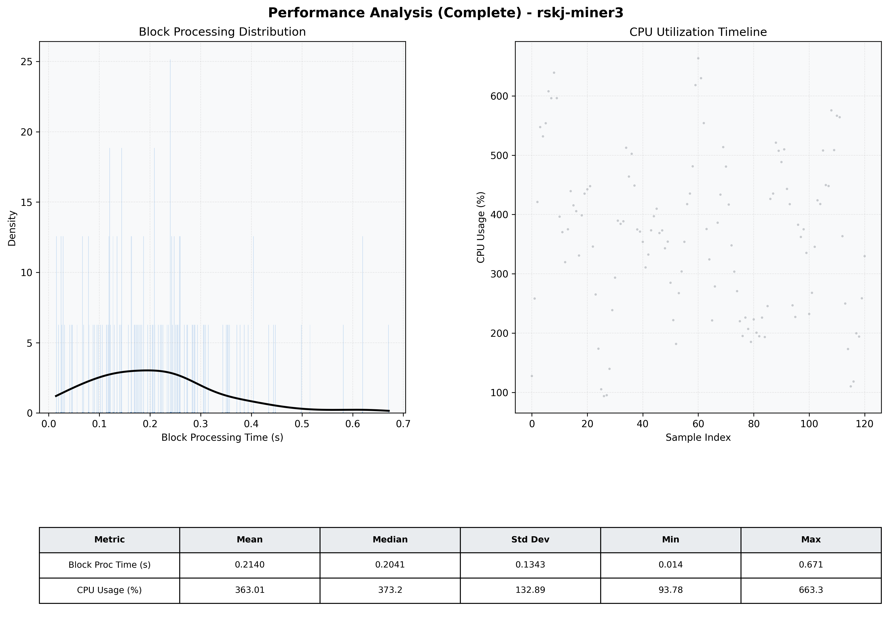

# Miner3 Quantitative Performance Report

| Category | Metric | Unit | Mean | Median | Min | Max |
| :--- | :--- | :--- | :--- | :--- | :--- | :--- |
| Processing | Block Processing Time | s | 0.214 | 0.204 | 0.014 | 0.671 |
|  | BlockExecution JMX | s | 0.119 | 0.107 | 0.015 | 0.430 |
| | Gas Consumed (per block) | M units | 14.32 | 16.27 | 0.34 | 16.94 |
| Resources | CPU Usage per Container | % | 363.01 | 373.17 | 93.78 | 663.34 |
|  | Memory Usage per Container | MiB | 3583.3 | 3728.6 | 1092.8 | 4095.9 |
| | CPU & Memory Assigned | - | 2.0 CPU, 4G | - | - | - |
| JVM | JVM Heap Used | MiB | 1458.0 | 1512.4 | 67.2 | 2611.2 |
| | JVM Heap Allocated | MiB | 3072.0 | 3072.0 | 3072.0 | 3072.0 |
| JVM GC | GC Copy Time | s | N/A | N/A | N/A | N/A |
| JVM GC | GC MarkSweep Time | s | N/A | N/A | N/A | N/A |
| Disk I/O | Disk Read | MiB/s | 0.067 | 0.000 | 0.000 | 4.054 |
|  | Disk Write | MiB/s | 0.001 | 0.001 | 0.000 | 0.006 |
| Network | Received Network Traffic per Container | KiB/s | 289.53 | 264.43 | 5.38 | 673.02 |
|  | Sent Network Traffic per Container | KiB/s | 350.82 | 322.57 | 12.85 | 892.93 |

