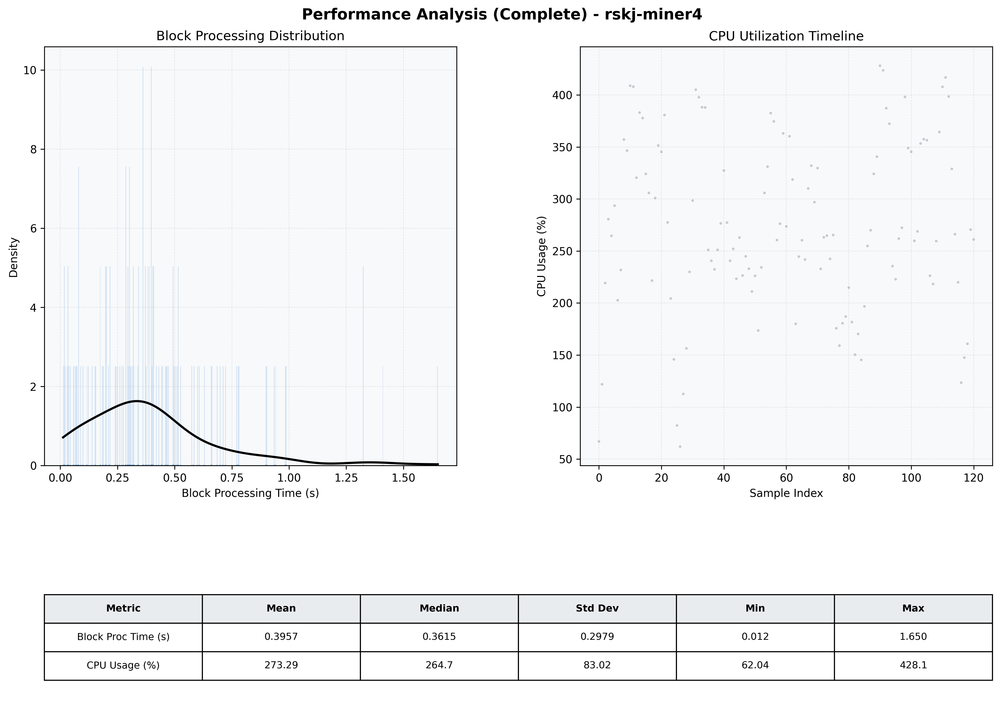

# Miner4 Quantitative Performance Report

| Category | Metric | Unit | Mean | Median | Min | Max |
| :--- | :--- | :--- | :--- | :--- | :--- | :--- |
| Processing | Block Processing Time | s | 0.396 | 0.362 | 0.012 | 1.650 |
|  | BlockExecution JMX | s | 0.206 | 0.159 | 0.012 | 0.613 |
| | Gas Consumed (per block) | M units | 14.32 | 16.27 | 0.34 | 16.94 |
| Resources | CPU Usage per Container | % | 273.29 | 264.75 | 62.04 | 428.06 |
|  | Memory Usage per Container | MiB | 2405.2 | 2406.6 | 857.4 | 3329.7 |
| | CPU & Memory Assigned | - | 1.0 CPU, 4G | - | - | - |
| JVM | JVM Heap Used | MiB | 907.5 | 884.3 | 71.2 | 1788.2 |
| | JVM Heap Allocated | MiB | 2969.6 | 2969.6 | 2969.6 | 2969.6 |
| JVM GC | GC Copy Time | s | 0.0113 | 0.0109 | 0.001 | 0.023 |
| JVM GC | GC MarkSweep Time | s | 0.0001 | 0.0000 | 0.000 | 0.007 |
| Disk I/O | Disk Read | MiB/s | 0.001 | 0.000 | 0.000 | 0.137 |
|  | Disk Write | MiB/s | 0.001 | 0.001 | 0.000 | 0.006 |
| Network | Received Network Traffic per Container | KiB/s | 306.67 | 268.14 | 5.39 | 827.91 |
|  | Sent Network Traffic per Container | KiB/s | 327.42 | 329.95 | 13.47 | 835.16 |

