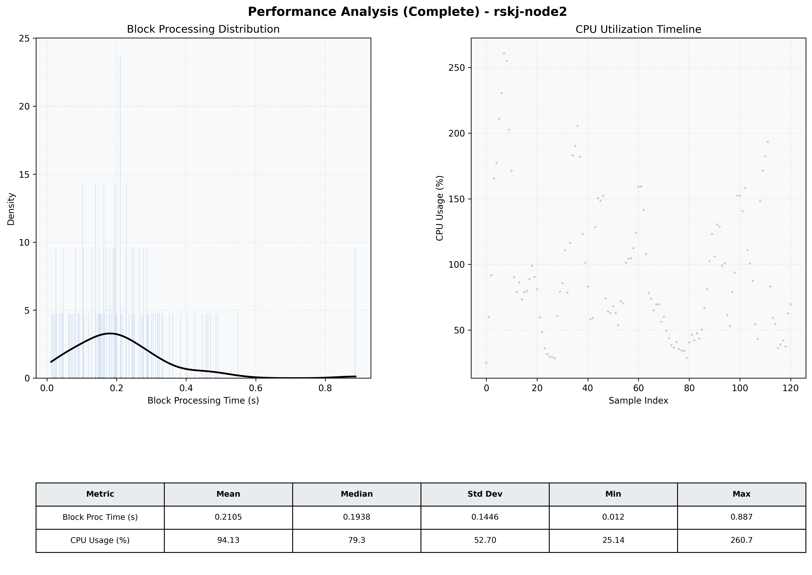

# Node2 Quantitative Performance Report

| Category | Metric | Unit | Mean | Median | Min | Max |
| :--- | :--- | :--- | :--- | :--- | :--- | :--- |
| Processing | Block Processing Time | s | 0.211 | 0.194 | 0.012 | 0.887 |
|  | BlockExecution JMX | s | 0.166 | 0.148 | 0.000 | 0.780 |
| | Gas Consumed (per block) | M units | 14.32 | 16.27 | 0.34 | 16.94 |
| Resources | CPU Usage per Container | % | 94.13 | 79.26 | 25.14 | 260.75 |
|  | Memory Usage per Container | MiB | 3128.3 | 3253.7 | 678.7 | 3687.0 |
| | CPU & Memory Assigned | - | 2.0 CPU, 4G | - | - | - |
| JVM | JVM Heap Used | MiB | 1000.8 | 890.0 | 170.3 | 2241.2 |
| | JVM Heap Allocated | MiB | 3072.0 | 3072.0 | 3072.0 | 3072.0 |
| JVM GC | GC Copy Time | s | N/A | N/A | N/A | N/A |
| JVM GC | GC MarkSweep Time | s | N/A | N/A | N/A | N/A |
| Disk I/O | Disk Read | MiB/s | 0.001 | 0.000 | 0.000 | 0.138 |
|  | Disk Write | MiB/s | 245.474 | 70.071 | 0.000 | 5814.595 |
| Network | Received Network Traffic per Container | KiB/s | 315.99 | 297.65 | 3.63 | 678.99 |
|  | Sent Network Traffic per Container | KiB/s | 256.72 | 228.95 | 9.07 | 669.97 |

