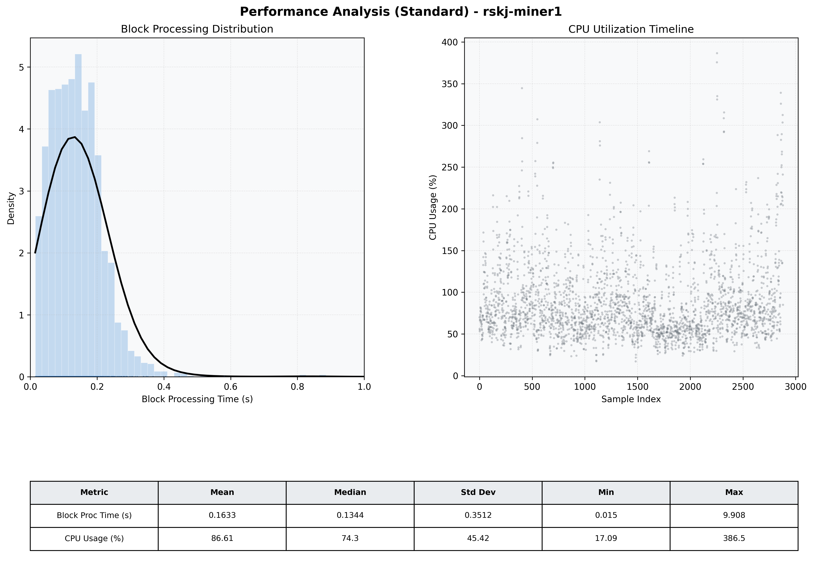

# Miner1 Quantitative Performance Report

| Category | Metric | Unit | Mean | Median | Min | Max |
| :--- | :--- | :--- | :--- | :--- | :--- | :--- |
| Processing | Block Processing Time | s | 0.163 | 0.134 | 0.015 | 9.908 |
|  | BlockExecution JMX | s | 0.086 | 0.074 | 0.009 | 0.893 |
| | Gas Consumed (per block) | M units | 11.28 | 14.02 | 0.00 | 16.98 |
| Resources | CPU Usage per Container | % | 86.61 | 74.28 | 17.09 | 386.55 |
|  | Memory Usage per Container | MiB | 7953.1 | 7974.3 | 7532.6 | 8192.0 |
| | CPU & Memory Assigned | - | 2.0 CPU, 8G | - | - | - |
| JVM | JVM Heap Used | MiB | 1871.1 | 1871.0 | 895.8 | 2736.7 |
| | JVM Heap Allocated | MiB | 3072.0 | 3072.0 | 3072.0 | 3072.0 |
| JVM GC | GC Copy Time | s | N/A | N/A | N/A | N/A |
| JVM GC | GC MarkSweep Time | s | N/A | N/A | N/A | N/A |
| Disk I/O | Disk Read | MiB/s | 119.613 | 24.969 | 0.000 | 30485.379 |
|  | Disk Write | MiB/s | 406.004 | 110.345 | 0.000 | 45972.138 |
| Network | Received Network Traffic per Container | KiB/s | 36.01 | 33.26 | 0.90 | 183.43 |
|  | Sent Network Traffic per Container | KiB/s | 58.63 | 56.50 | 5.02 | 293.48 |

