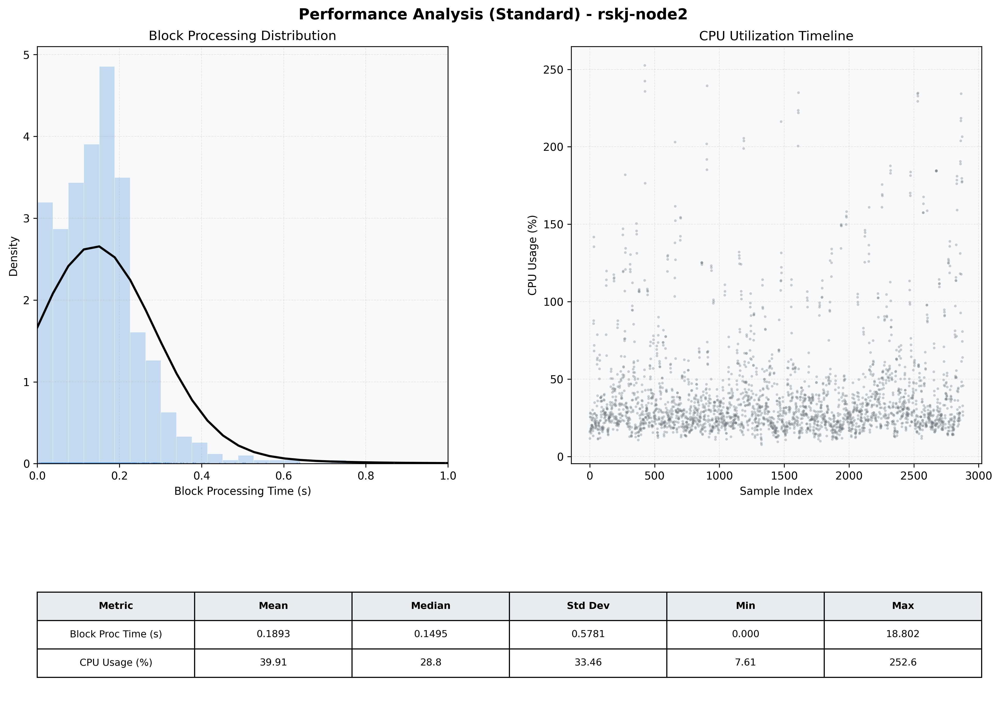

# Node2 Quantitative Performance Report

| Category | Metric | Unit | Mean | Median | Min | Max |
| :--- | :--- | :--- | :--- | :--- | :--- | :--- |
| Processing | Block Processing Time | s | 0.189 | 0.149 | 0.000 | 18.802 |
|  | BlockExecution JMX | s | 0.089 | 0.079 | 0.003 | 0.950 |
| | Gas Consumed (per block) | M units | 11.28 | 14.02 | 0.00 | 16.98 |
| Resources | CPU Usage per Container | % | 39.91 | 28.77 | 7.61 | 252.55 |
|  | Memory Usage per Container | MiB | 4061.1 | 4094.4 | 3688.6 | 4096.0 |
| | CPU & Memory Assigned | - | 2.0 CPU, 4G | - | - | - |
| JVM | JVM Heap Used | MiB | 1679.7 | 1630.2 | 1024.2 | 2717.0 |
| | JVM Heap Allocated | MiB | 3072.0 | 3072.0 | 3072.0 | 3072.0 |
| JVM GC | GC Copy Time | s | N/A | N/A | N/A | N/A |
| JVM GC | GC MarkSweep Time | s | N/A | N/A | N/A | N/A |
| Disk I/O | Disk Read | MiB/s | 363.192 | 82.069 | 0.000 | 61083.862 |
|  | Disk Write | MiB/s | 346.439 | 21.378 | 0.000 | 65750.621 |
| Network | Received Network Traffic per Container | KiB/s | 59.00 | 55.11 | 0.61 | 270.66 |
|  | Sent Network Traffic per Container | KiB/s | 30.17 | 28.65 | 4.49 | 104.74 |

