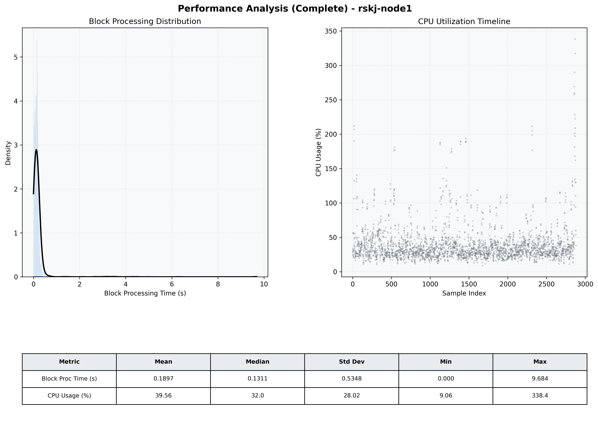

# Node1 Quantitative Performance Report

| Category | Metric | Unit | Mean | Median | Min | Max |
| :--- | :--- | :--- | :--- | :--- | :--- | :--- |
| Processing | Block Processing Time | s | 0.190 | 0.131 | 0.000 | 9.684 |
|  | BlockExecution JMX | s | 0.138 | 0.067 | 0.002 | 9.556 |
| | Gas Consumed (per block) | M units | 11.28 | 14.02 | 0.00 | 16.98 |
| Resources | CPU Usage per Container | % | 39.56 | 31.97 | 9.06 | 338.35 |
|  | Memory Usage per Container | MiB | 4044.2 | 4085.2 | 3693.4 | 4096.0 |
| | CPU & Memory Assigned | - | 1.0 CPU, 4G | - | - | - |
| JVM | JVM Heap Used | MiB | 1922.9 | 1922.9 | 878.2 | 2904.6 |
| | JVM Heap Allocated | MiB | 2969.6 | 2969.6 | 2969.6 | 2969.6 |
| JVM GC | GC Copy Time | s | 0.0044 | 0.0037 | 0.000 | 0.044 |
| JVM GC | GC MarkSweep Time | s | 0.0010 | 0.0000 | 0.000 | 0.796 |
| Disk I/O | Disk Read | MiB/s | 327.770 | 75.037 | 0.000 | 30328.978 |
|  | Disk Write | MiB/s | 334.235 | 22.208 | 0.000 | 32148.664 |
| Network | Received Network Traffic per Container | KiB/s | 68.76 | 64.53 | 0.61 | 282.07 |
|  | Sent Network Traffic per Container | KiB/s | 59.63 | 55.80 | 0.26 | 263.70 |

