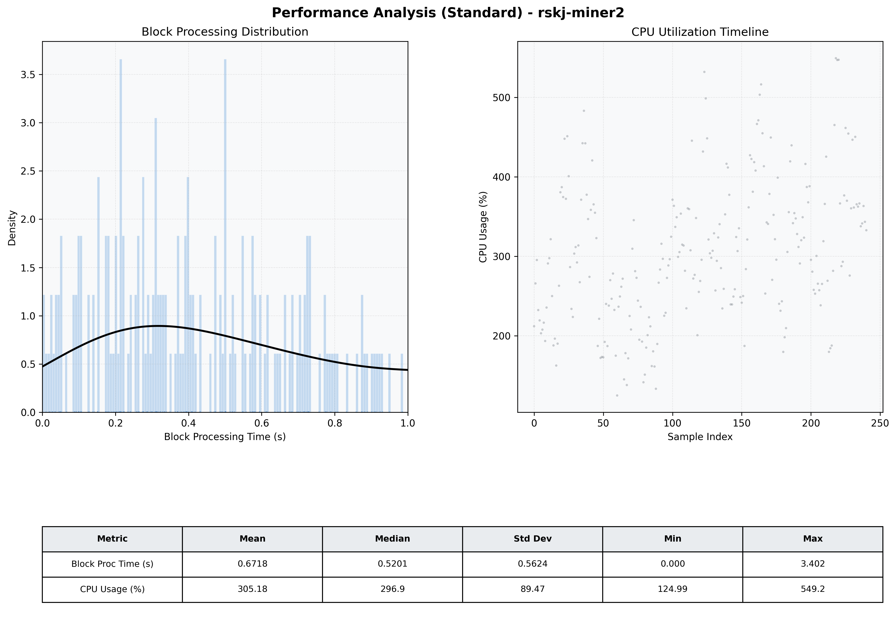

# Miner2 Quantitative Performance Report

| Category | Metric | Unit | Mean | Median | Min | Max |
| :--- | :--- | :--- | :--- | :--- | :--- | :--- |
| Processing | Block Processing Time | s | 0.672 | 0.520 | 0.000 | 3.402 |
|  | BlockExecution JMX | s | 0.311 | 0.254 | 0.012 | 0.999 |
| | Gas Consumed (per block) | M units | 14.13 | 16.33 | 0.21 | 16.97 |
| Resources | CPU Usage per Container | % | 305.18 | 296.91 | 124.99 | 549.25 |
|  | Memory Usage per Container | MiB | 3627.0 | 3810.8 | 2564.8 | 4096.0 |
| | CPU & Memory Assigned | - | 1.0 CPU, 4G | - | - | - |
| JVM | JVM Heap Used | MiB | 1725.9 | 1722.9 | 646.8 | 2828.5 |
| | JVM Heap Allocated | MiB | 2969.6 | 2969.6 | 2969.6 | 2969.6 |
| JVM GC | GC Copy Time | s | 0.0222 | 0.0194 | 0.003 | 0.071 |
| JVM GC | GC MarkSweep Time | s | 0.0000 | 0.0000 | 0.000 | 0.000 |
| Disk I/O | Disk Read | MiB/s | 134.851 | 0.000 | 0.000 | 7746.862 |
|  | Disk Write | MiB/s | 935.073 | 672.046 | 0.000 | 9383.310 |
| Network | Received Network Traffic per Container | KiB/s | 253.80 | 219.84 | 5.99 | 1158.07 |
|  | Sent Network Traffic per Container | KiB/s | 268.13 | 245.94 | 0.25 | 706.58 |

