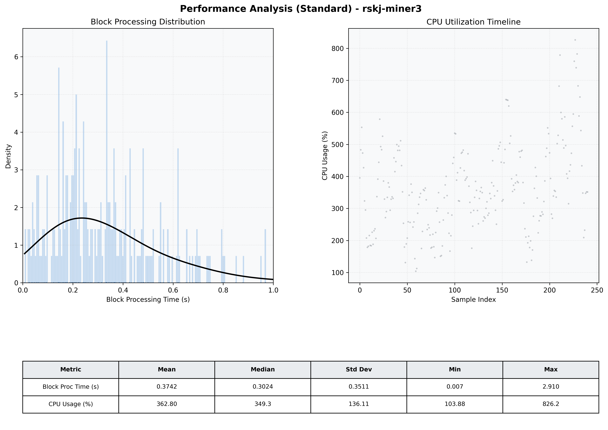

# Miner3 Quantitative Performance Report

| Category | Metric | Unit | Mean | Median | Min | Max |
| :--- | :--- | :--- | :--- | :--- | :--- | :--- |
| Processing | Block Processing Time | s | 0.374 | 0.302 | 0.007 | 2.910 |
|  | BlockExecution JMX | s | 0.204 | 0.157 | 0.018 | 0.866 |
| | Gas Consumed (per block) | M units | 14.13 | 16.33 | 0.21 | 16.97 |
| Resources | CPU Usage per Container | % | 362.80 | 349.26 | 103.88 | 826.21 |
|  | Memory Usage per Container | MiB | 4048.8 | 4063.4 | 3777.0 | 4096.0 |
| | CPU & Memory Assigned | - | 2.0 CPU, 4G | - | - | - |
| JVM | JVM Heap Used | MiB | 1936.9 | 1952.0 | 665.6 | 2737.8 |
| | JVM Heap Allocated | MiB | 3072.0 | 3072.0 | 3072.0 | 3072.0 |
| JVM GC | GC Copy Time | s | N/A | N/A | N/A | N/A |
| JVM GC | GC MarkSweep Time | s | N/A | N/A | N/A | N/A |
| Disk I/O | Disk Read | MiB/s | 473.049 | 59.308 | 0.000 | 10562.483 |
|  | Disk Write | MiB/s | 0.001 | 0.001 | 0.000 | 0.014 |
| Network | Received Network Traffic per Container | KiB/s | 234.32 | 211.02 | 3.83 | 642.94 |
|  | Sent Network Traffic per Container | KiB/s | 291.11 | 265.93 | 13.00 | 784.45 |

