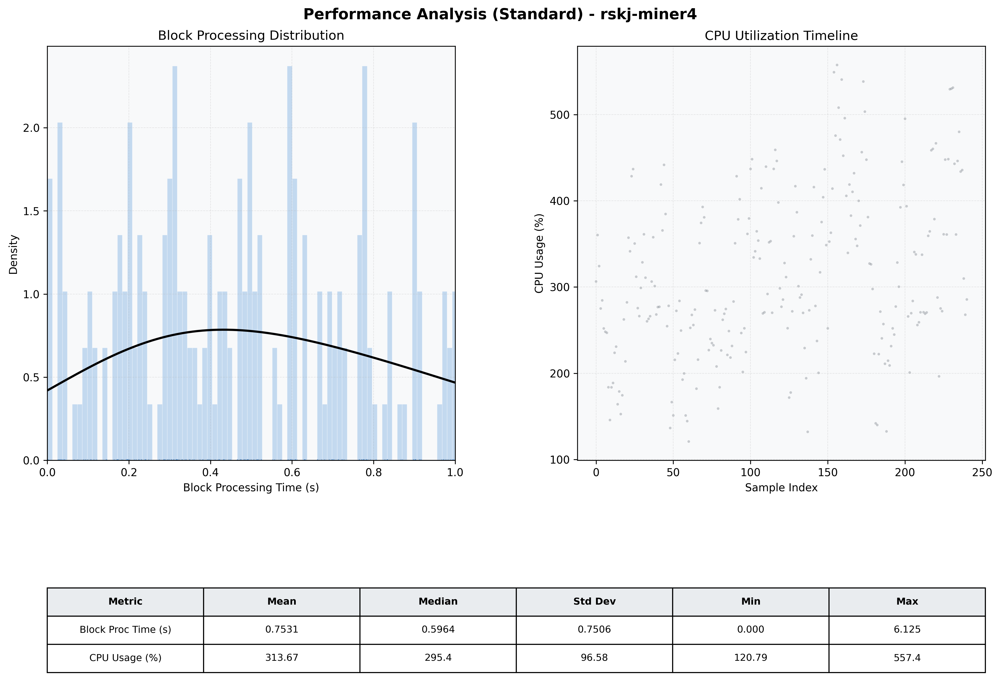

# Miner4 Quantitative Performance Report

| Category | Metric | Unit | Mean | Median | Min | Max |
| :--- | :--- | :--- | :--- | :--- | :--- | :--- |
| Processing | Block Processing Time | s | 0.753 | 0.596 | 0.000 | 6.125 |
|  | BlockExecution JMX | s | 0.317 | 0.284 | 0.020 | 0.989 |
| | Gas Consumed (per block) | M units | 14.13 | 16.33 | 0.21 | 16.97 |
| Resources | CPU Usage per Container | % | 313.67 | 295.45 | 120.79 | 557.43 |
|  | Memory Usage per Container | MiB | 3693.0 | 3942.2 | 2458.5 | 4095.9 |
| | CPU & Memory Assigned | - | 1.0 CPU, 4G | - | - | - |
| JVM | JVM Heap Used | MiB | 1753.9 | 1768.8 | 649.4 | 2749.4 |
| | JVM Heap Allocated | MiB | 2969.6 | 2969.6 | 2969.6 | 2969.6 |
| JVM GC | GC Copy Time | s | 0.0191 | 0.0164 | 0.002 | 0.067 |
| JVM GC | GC MarkSweep Time | s | 0.0000 | 0.0000 | 0.000 | 0.000 |
| Disk I/O | Disk Read | MiB/s | 39.918 | 0.000 | 0.000 | 2745.758 |
|  | Disk Write | MiB/s | 0.001 | 0.001 | 0.000 | 0.009 |
| Network | Received Network Traffic per Container | KiB/s | 259.89 | 227.83 | 1.04 | 717.30 |
|  | Sent Network Traffic per Container | KiB/s | 266.54 | 247.42 | 0.15 | 694.93 |

