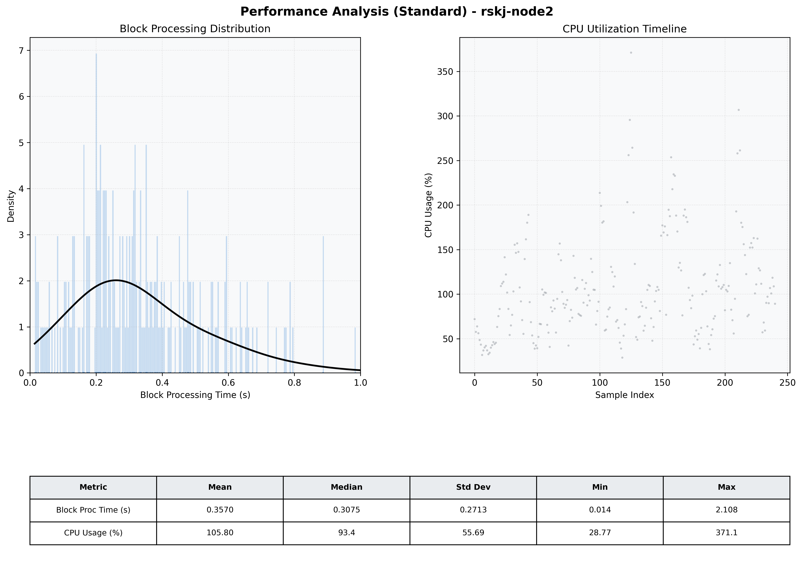

# Node2 Quantitative Performance Report

| Category | Metric | Unit | Mean | Median | Min | Max |
| :--- | :--- | :--- | :--- | :--- | :--- | :--- |
| Processing | Block Processing Time | s | 0.357 | 0.307 | 0.014 | 2.108 |
|  | BlockExecution JMX | s | 0.247 | 0.217 | 0.015 | 0.995 |
| | Gas Consumed (per block) | M units | 14.13 | 16.33 | 0.21 | 16.97 |
| Resources | CPU Usage per Container | % | 105.80 | 93.40 | 28.77 | 371.08 |
|  | Memory Usage per Container | MiB | 3890.6 | 4013.6 | 3304.6 | 4095.6 |
| | CPU & Memory Assigned | - | 2.0 CPU, 4G | - | - | - |
| JVM | JVM Heap Used | MiB | 1505.9 | 1541.3 | 572.6 | 2679.9 |
| | JVM Heap Allocated | MiB | 3072.0 | 3072.0 | 3072.0 | 3072.0 |
| JVM GC | GC Copy Time | s | N/A | N/A | N/A | N/A |
| JVM GC | GC MarkSweep Time | s | N/A | N/A | N/A | N/A |
| Disk I/O | Disk Read | MiB/s | 105.259 | 0.000 | 0.000 | 8536.515 |
|  | Disk Write | MiB/s | 334.629 | 53.924 | 0.690 | 10244.535 |
| Network | Received Network Traffic per Container | KiB/s | 252.82 | 228.05 | 3.79 | 627.26 |
|  | Sent Network Traffic per Container | KiB/s | 222.38 | 200.20 | 11.63 | 645.51 |

