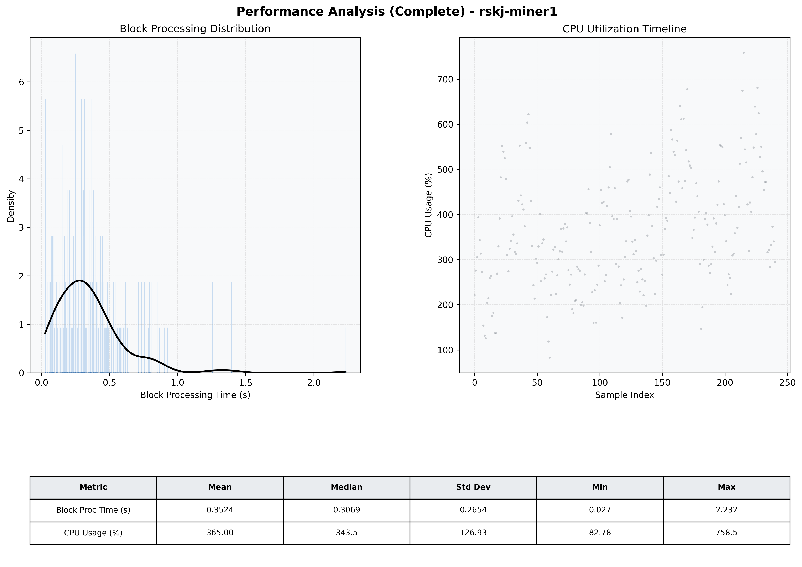

# Miner1 Quantitative Performance Report

| Category | Metric | Unit | Mean | Median | Min | Max |
| :--- | :--- | :--- | :--- | :--- | :--- | :--- |
| Processing | Block Processing Time | s | 0.352 | 0.307 | 0.027 | 2.232 |
|  | BlockExecution JMX | s | 0.191 | 0.158 | 0.015 | 1.606 |
| | Gas Consumed (per block) | M units | 14.13 | 16.33 | 0.21 | 16.97 |
| Resources | CPU Usage per Container | % | 365.00 | 343.49 | 82.78 | 758.49 |
|  | Memory Usage per Container | MiB | 4788.1 | 4866.5 | 3661.3 | 5706.5 |
| | CPU & Memory Assigned | - | 2.0 CPU, 8G | - | - | - |
| JVM | JVM Heap Used | MiB | 1843.0 | 1889.4 | 692.5 | 2742.5 |
| | JVM Heap Allocated | MiB | 3072.0 | 3072.0 | 3072.0 | 3072.0 |
| JVM GC | GC Copy Time | s | N/A | N/A | N/A | N/A |
| JVM GC | GC MarkSweep Time | s | N/A | N/A | N/A | N/A |
| Disk I/O | Disk Read | MiB/s | 0.105 | 0.000 | 0.000 | 19.178 |
|  | Disk Write | MiB/s | 925.293 | 645.037 | 0.000 | 10633.474 |
| Network | Received Network Traffic per Container | KiB/s | 248.66 | 218.45 | 4.06 | 625.01 |
|  | Sent Network Traffic per Container | KiB/s | 222.62 | 191.53 | 12.06 | 634.82 |

