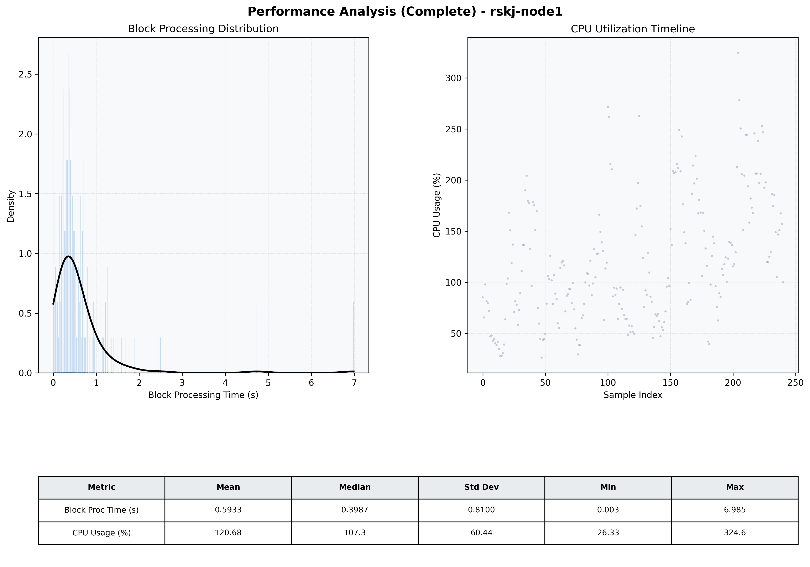

# Node1 Quantitative Performance Report

| Category | Metric | Unit | Mean | Median | Min | Max |
| :--- | :--- | :--- | :--- | :--- | :--- | :--- |
| Processing | Block Processing Time | s | 0.593 | 0.399 | 0.003 | 6.985 |
|  | BlockExecution JMX | s | 0.419 | 0.289 | 0.011 | 3.924 |
| | Gas Consumed (per block) | M units | 14.13 | 16.33 | 0.21 | 16.97 |
| Resources | CPU Usage per Container | % | 120.68 | 107.30 | 26.33 | 324.65 |
|  | Memory Usage per Container | MiB | 3037.4 | 3059.9 | 2123.2 | 3914.2 |
| | CPU & Memory Assigned | - | 1.0 CPU, 4G | - | - | - |
| JVM | JVM Heap Used | MiB | 1516.2 | 1532.0 | 588.5 | 2495.7 |
| | JVM Heap Allocated | MiB | 2969.6 | 2969.6 | 2969.6 | 2969.6 |
| JVM GC | GC Copy Time | s | 0.0120 | 0.0088 | 0.000 | 0.059 |
| JVM GC | GC MarkSweep Time | s | 0.0000 | 0.0000 | 0.000 | 0.000 |
| Disk I/O | Disk Read | MiB/s | 0.026 | 0.000 | 0.000 | 2.896 |
|  | Disk Write | MiB/s | 361.130 | 59.032 | 0.690 | 9112.552 |
| Network | Received Network Traffic per Container | KiB/s | 296.98 | 273.19 | 5.74 | 963.52 |
|  | Sent Network Traffic per Container | KiB/s | 232.67 | 198.47 | 13.76 | 653.01 |

