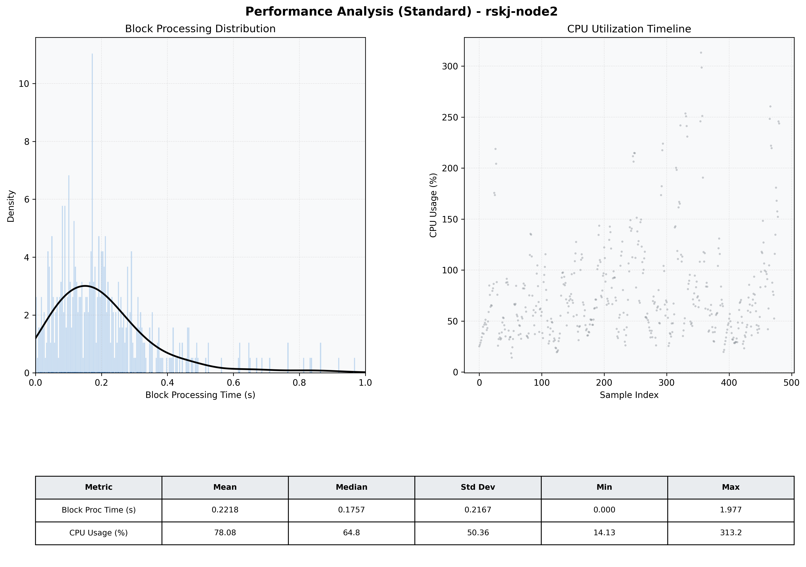

# Node2 Quantitative Performance Report

| Category | Metric | Unit | Mean | Median | Min | Max |
| :--- | :--- | :--- | :--- | :--- | :--- | :--- |
| Processing | Block Processing Time | s | 0.222 | 0.176 | 0.000 | 1.977 |
|  | BlockExecution JMX | s | 0.150 | 0.114 | 0.004 | 0.786 |
| | Gas Consumed (per block) | M units | 13.06 | 16.13 | 0.06 | 16.96 |
| Resources | CPU Usage per Container | % | 78.08 | 64.79 | 14.13 | 313.24 |
|  | Memory Usage per Container | MiB | 4009.8 | 4050.3 | 3562.8 | 4095.9 |
| | CPU & Memory Assigned | - | 2.0 CPU, 4G | - | - | - |
| JVM | JVM Heap Used | MiB | 1650.3 | 1595.6 | 771.5 | 2664.3 |
| | JVM Heap Allocated | MiB | 3072.0 | 3072.0 | 3072.0 | 3072.0 |
| JVM GC | GC Copy Time | s | N/A | N/A | N/A | N/A |
| JVM GC | GC MarkSweep Time | s | N/A | N/A | N/A | N/A |
| Disk I/O | Disk Read | MiB/s | 222.247 | 40.690 | 0.000 | 12856.798 |
|  | Disk Write | MiB/s | 368.785 | 48.550 | 0.552 | 15308.713 |
| Network | Received Network Traffic per Container | KiB/s | 208.31 | 194.27 | 1.48 | 533.24 |
|  | Sent Network Traffic per Container | KiB/s | 149.40 | 141.45 | 9.72 | 346.79 |

