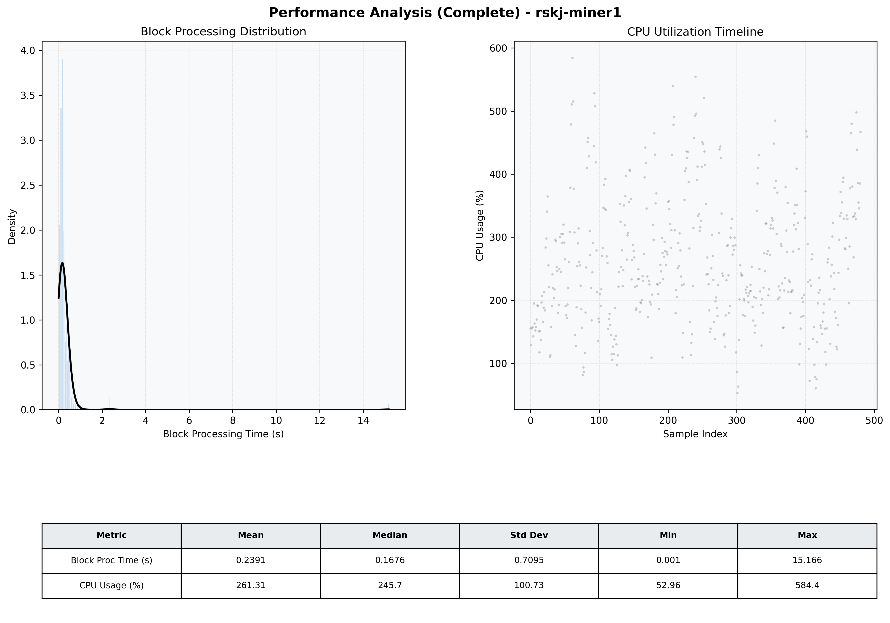

# Miner1 Quantitative Performance Report

| Category | Metric | Unit | Mean | Median | Min | Max |
| :--- | :--- | :--- | :--- | :--- | :--- | :--- |
| Processing | Block Processing Time | s | 0.239 | 0.168 | 0.001 | 15.166 |
|  | BlockExecution JMX | s | 0.145 | 0.086 | 0.008 | 15.089 |
| | Gas Consumed (per block) | M units | 13.06 | 16.13 | 0.06 | 16.96 |
| Resources | CPU Usage per Container | % | 261.31 | 245.73 | 52.96 | 584.41 |
|  | Memory Usage per Container | MiB | 5391.8 | 5483.9 | 3850.5 | 6389.5 |
| | CPU & Memory Assigned | - | 2.0 CPU, 8G | - | - | - |
| JVM | JVM Heap Used | MiB | 1951.1 | 1953.8 | 920.6 | 2728.9 |
| | JVM Heap Allocated | MiB | 3072.0 | 3072.0 | 3072.0 | 3072.0 |
| JVM GC | GC Copy Time | s | N/A | N/A | N/A | N/A |
| JVM GC | GC MarkSweep Time | s | N/A | N/A | N/A | N/A |
| Disk I/O | Disk Read | MiB/s | 0.015 | 0.000 | 0.000 | 2.759 |
|  | Disk Write | MiB/s | 775.088 | 440.276 | 0.000 | 15103.479 |
| Network | Received Network Traffic per Container | KiB/s | 182.89 | 176.45 | 2.12 | 503.96 |
|  | Sent Network Traffic per Container | KiB/s | 189.62 | 176.25 | 10.27 | 539.79 |

