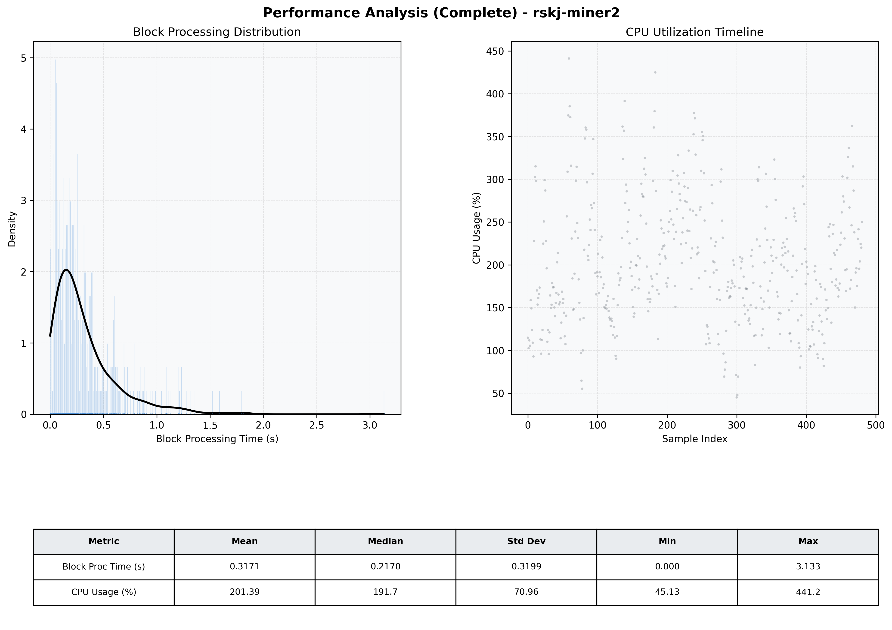

# Miner2 Quantitative Performance Report

| Category | Metric | Unit | Mean | Median | Min | Max |
| :--- | :--- | :--- | :--- | :--- | :--- | :--- |
| Processing | Block Processing Time | s | 0.317 | 0.217 | 0.000 | 3.133 |
|  | BlockExecution JMX | s | 0.187 | 0.119 | 0.015 | 5.388 |
| | Gas Consumed (per block) | M units | 13.06 | 16.13 | 0.06 | 16.96 |
| Resources | CPU Usage per Container | % | 201.39 | 191.70 | 45.13 | 441.23 |
|  | Memory Usage per Container | MiB | 3867.7 | 4039.6 | 2750.9 | 4095.9 |
| | CPU & Memory Assigned | - | 1.0 CPU, 4G | - | - | - |
| JVM | JVM Heap Used | MiB | 1852.9 | 1845.9 | 820.3 | 2824.8 |
| | JVM Heap Allocated | MiB | 2969.6 | 2969.6 | 2969.6 | 2969.6 |
| JVM GC | GC Copy Time | s | 0.0128 | 0.0113 | 0.000 | 0.061 |
| JVM GC | GC MarkSweep Time | s | 0.0013 | 0.0000 | 0.000 | 0.649 |
| Disk I/O | Disk Read | MiB/s | 304.842 | 31.309 | 0.000 | 12773.873 |
|  | Disk Write | MiB/s | 850.868 | 484.673 | 0.000 | 14103.652 |
| Network | Received Network Traffic per Container | KiB/s | 175.70 | 163.20 | 1.47 | 510.39 |
|  | Sent Network Traffic per Container | KiB/s | 197.54 | 186.62 | 10.24 | 491.56 |

