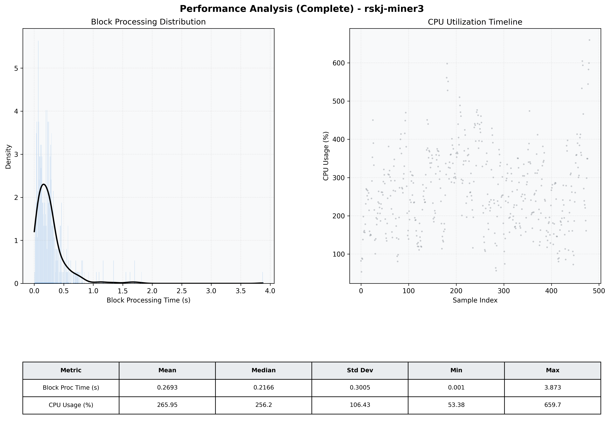

# Miner3 Quantitative Performance Report

| Category | Metric | Unit | Mean | Median | Min | Max |
| :--- | :--- | :--- | :--- | :--- | :--- | :--- |
| Processing | Block Processing Time | s | 0.269 | 0.217 | 0.001 | 3.873 |
|  | BlockExecution JMX | s | 0.168 | 0.115 | 0.011 | 3.041 |
| | Gas Consumed (per block) | M units | 13.06 | 16.13 | 0.06 | 16.96 |
| Resources | CPU Usage per Container | % | 265.95 | 256.22 | 53.38 | 659.75 |
|  | Memory Usage per Container | MiB | 4051.5 | 4062.9 | 3695.1 | 4096.0 |
| | CPU & Memory Assigned | - | 2.0 CPU, 4G | - | - | - |
| JVM | JVM Heap Used | MiB | 1914.0 | 1931.2 | 883.3 | 2724.1 |
| | JVM Heap Allocated | MiB | 3072.0 | 3072.0 | 3072.0 | 3072.0 |
| JVM GC | GC Copy Time | s | N/A | N/A | N/A | N/A |
| JVM GC | GC MarkSweep Time | s | N/A | N/A | N/A | N/A |
| Disk I/O | Disk Read | MiB/s | 618.858 | 126.474 | 0.000 | 10586.807 |
|  | Disk Write | MiB/s | 933.803 | 482.930 | 0.000 | 19115.755 |
| Network | Received Network Traffic per Container | KiB/s | 178.41 | 168.27 | 1.49 | 452.86 |
|  | Sent Network Traffic per Container | KiB/s | 198.85 | 186.05 | 9.75 | 572.03 |

