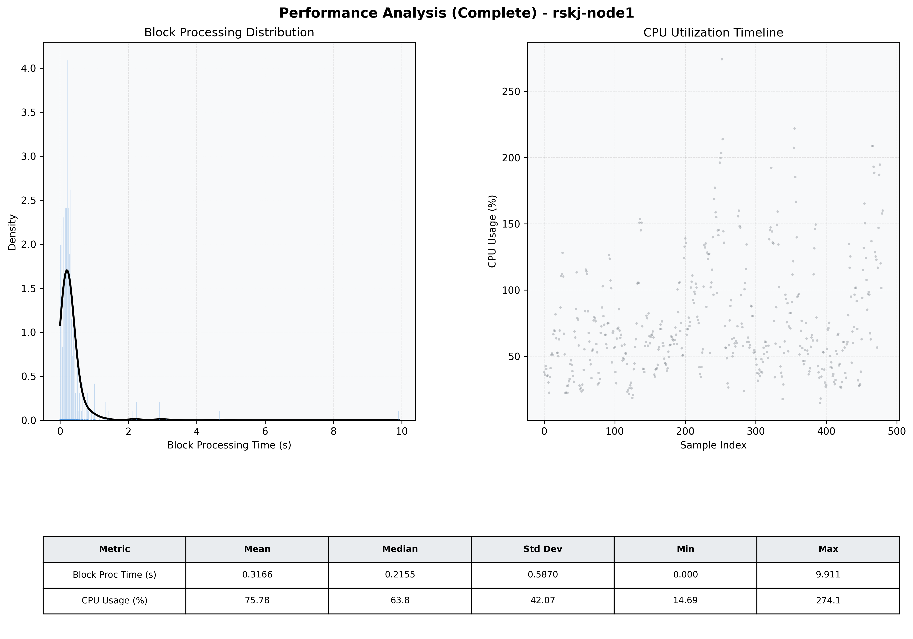

# Node1 Quantitative Performance Report

| Category | Metric | Unit | Mean | Median | Min | Max |
| :--- | :--- | :--- | :--- | :--- | :--- | :--- |
| Processing | Block Processing Time | s | 0.317 | 0.216 | 0.000 | 9.911 |
|  | BlockExecution JMX | s | 0.236 | 0.134 | 0.004 | 9.679 |
| | Gas Consumed (per block) | M units | 13.06 | 16.13 | 0.06 | 16.96 |
| Resources | CPU Usage per Container | % | 75.78 | 63.82 | 14.69 | 274.15 |
|  | Memory Usage per Container | MiB | 3635.4 | 3950.0 | 2405.1 | 4095.9 |
| | CPU & Memory Assigned | - | 1.0 CPU, 4G | - | - | - |
| JVM | JVM Heap Used | MiB | 1827.3 | 1818.6 | 819.7 | 2843.9 |
| | JVM Heap Allocated | MiB | 2969.6 | 2969.6 | 2969.6 | 2969.6 |
| JVM GC | GC Copy Time | s | 0.0076 | 0.0054 | 0.000 | 0.063 |
| JVM GC | GC MarkSweep Time | s | 0.0011 | 0.0000 | 0.000 | 0.531 |
| Disk I/O | Disk Read | MiB/s | 156.460 | 0.000 | 0.000 | 11332.989 |
|  | Disk Write | MiB/s | 399.826 | 53.797 | 0.000 | 14801.559 |
| Network | Received Network Traffic per Container | KiB/s | 201.50 | 189.28 | 1.46 | 516.61 |
|  | Sent Network Traffic per Container | KiB/s | 173.55 | 163.42 | 1.20 | 446.95 |

