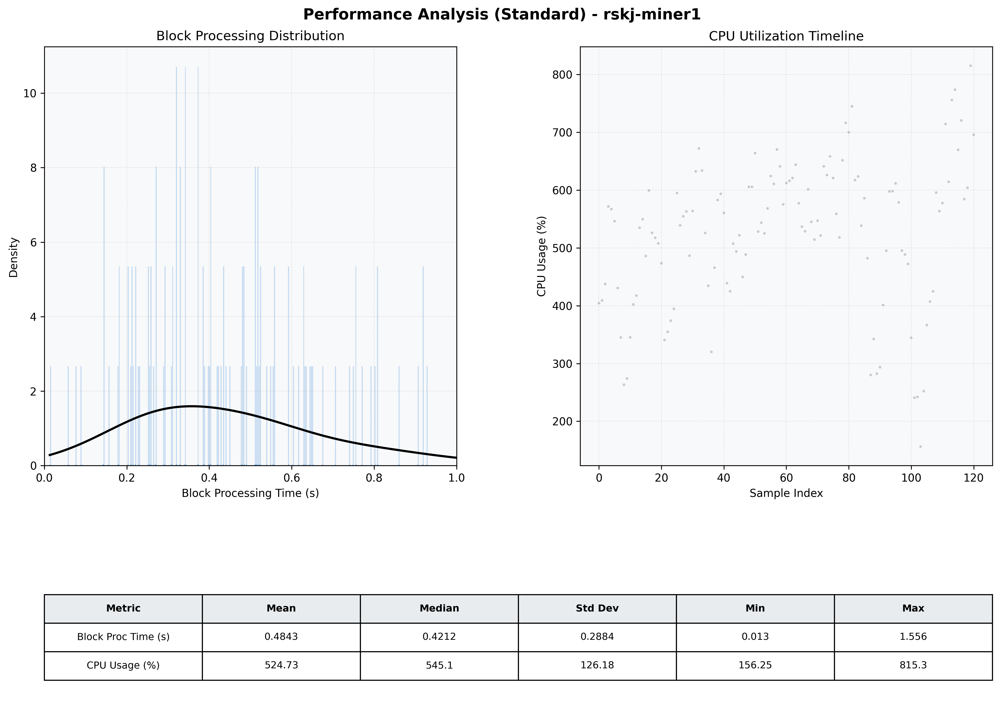

# Miner1 Quantitative Performance Report

| Category | Metric | Unit | Mean | Median | Min | Max |
| :--- | :--- | :--- | :--- | :--- | :--- | :--- |
| Processing | Block Processing Time | s | 0.484 | 0.421 | 0.013 | 1.556 |
|  | BlockExecution JMX | s | 0.263 | 0.218 | 0.077 | 0.920 |
| | Gas Consumed (per block) | M units | 20.37 | 24.06 | 1.86 | 24.93 |
| Resources | CPU Usage per Container | % | 524.73 | 545.07 | 156.25 | 815.28 |
|  | Memory Usage per Container | MiB | 5308.7 | 5382.1 | 4544.4 | 6008.9 |
| | CPU & Memory Assigned | - | 2.0 CPU, 8G | - | - | - |
| JVM | JVM Heap Used | MiB | 2171.1 | 2145.1 | 1432.6 | 2876.3 |
| | JVM Heap Allocated | MiB | 3072.0 | 3072.0 | 3072.0 | 3072.0 |
| JVM GC | GC Copy Time | s | N/A | N/A | N/A | N/A |
| JVM GC | GC MarkSweep Time | s | N/A | N/A | N/A | N/A |
| Disk I/O | Disk Read | MiB/s | 0.059 | 0.000 | 0.000 | 4.552 |
|  | Disk Write | MiB/s | 0.001 | 0.001 | 0.000 | 0.010 |
| Network | Received Network Traffic per Container | KiB/s | 355.16 | 336.81 | 3.32 | 1034.57 |
|  | Sent Network Traffic per Container | KiB/s | 373.15 | 321.25 | 11.20 | 1080.98 |

