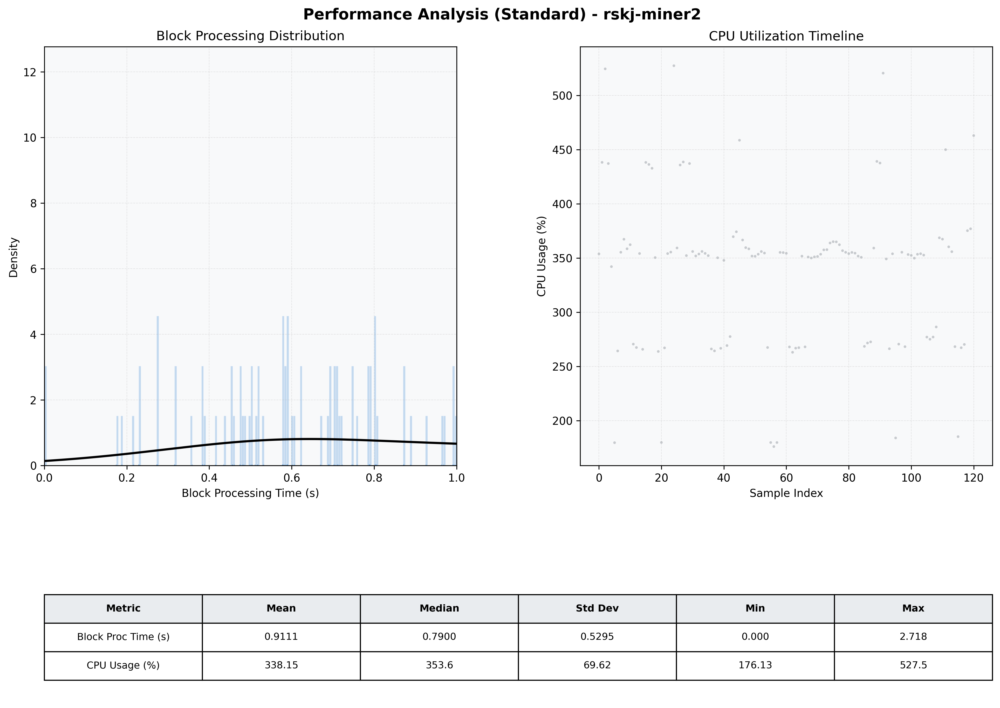

# Miner2 Quantitative Performance Report

| Category | Metric | Unit | Mean | Median | Min | Max |
| :--- | :--- | :--- | :--- | :--- | :--- | :--- |
| Processing | Block Processing Time | s | 0.911 | 0.790 | 0.000 | 2.718 |
|  | BlockExecution JMX | s | 0.404 | 0.373 | 0.101 | 0.921 |
| | Gas Consumed (per block) | M units | 20.37 | 24.06 | 1.86 | 24.93 |
| Resources | CPU Usage per Container | % | 338.15 | 353.59 | 176.13 | 527.48 |
|  | Memory Usage per Container | MiB | 4037.1 | 4071.5 | 3692.2 | 4096.0 |
| | CPU & Memory Assigned | - | 1.0 CPU, 4G | - | - | - |
| JVM | JVM Heap Used | MiB | 2183.4 | 2181.7 | 1528.1 | 2847.0 |
| | JVM Heap Allocated | MiB | 2969.6 | 2969.6 | 2969.6 | 2969.6 |
| JVM GC | GC Copy Time | s | 0.0273 | 0.0266 | 0.005 | 0.055 |
| JVM GC | GC MarkSweep Time | s | 0.0206 | 0.0000 | 0.000 | 0.651 |
| Disk I/O | Disk Read | MiB/s | 672.245 | 91.317 | 0.000 | 7757.877 |
|  | Disk Write | MiB/s | 0.001 | 0.001 | 0.000 | 0.011 |
| Network | Received Network Traffic per Container | KiB/s | 370.64 | 326.20 | 5.18 | 971.58 |
|  | Sent Network Traffic per Container | KiB/s | 360.03 | 339.97 | 13.29 | 1157.10 |

