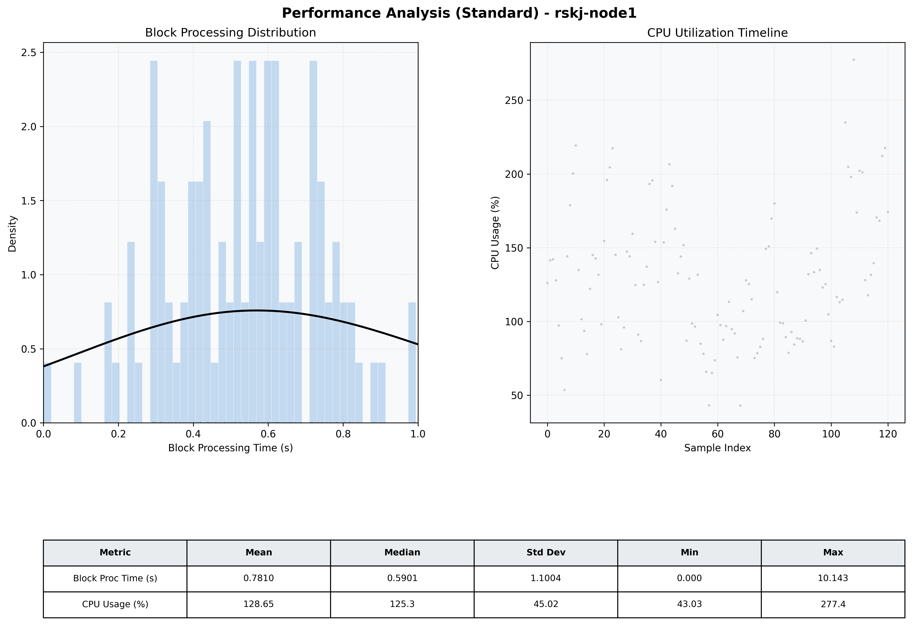

# Node1 Quantitative Performance Report

| Category | Metric | Unit | Mean | Median | Min | Max |
| :--- | :--- | :--- | :--- | :--- | :--- | :--- |
| Processing | Block Processing Time | s | 0.781 | 0.590 | 0.000 | 10.143 |
|  | BlockExecution JMX | s | 0.408 | 0.397 | 0.082 | 0.996 |
| | Gas Consumed (per block) | M units | 20.37 | 24.06 | 1.86 | 24.93 |
| Resources | CPU Usage per Container | % | 128.65 | 125.34 | 43.03 | 277.43 |
|  | Memory Usage per Container | MiB | 3460.7 | 3475.2 | 2803.5 | 4095.3 |
| | CPU & Memory Assigned | - | 1.0 CPU, 4G | - | - | - |
| JVM | JVM Heap Used | MiB | 1776.6 | 1770.8 | 1035.5 | 2424.3 |
| | JVM Heap Allocated | MiB | 2969.6 | 2969.6 | 2969.6 | 2969.6 |
| JVM GC | GC Copy Time | s | 0.0150 | 0.0128 | 0.000 | 0.044 |
| JVM GC | GC MarkSweep Time | s | 0.0000 | 0.0000 | 0.000 | 0.000 |
| Disk I/O | Disk Read | MiB/s | 0.081 | 0.000 | 0.000 | 5.796 |
|  | Disk Write | MiB/s | 529.587 | 87.727 | 4.276 | 10133.747 |
| Network | Received Network Traffic per Container | KiB/s | 377.42 | 325.09 | 5.29 | 990.96 |
|  | Sent Network Traffic per Container | KiB/s | 349.21 | 307.90 | 13.69 | 1032.35 |

