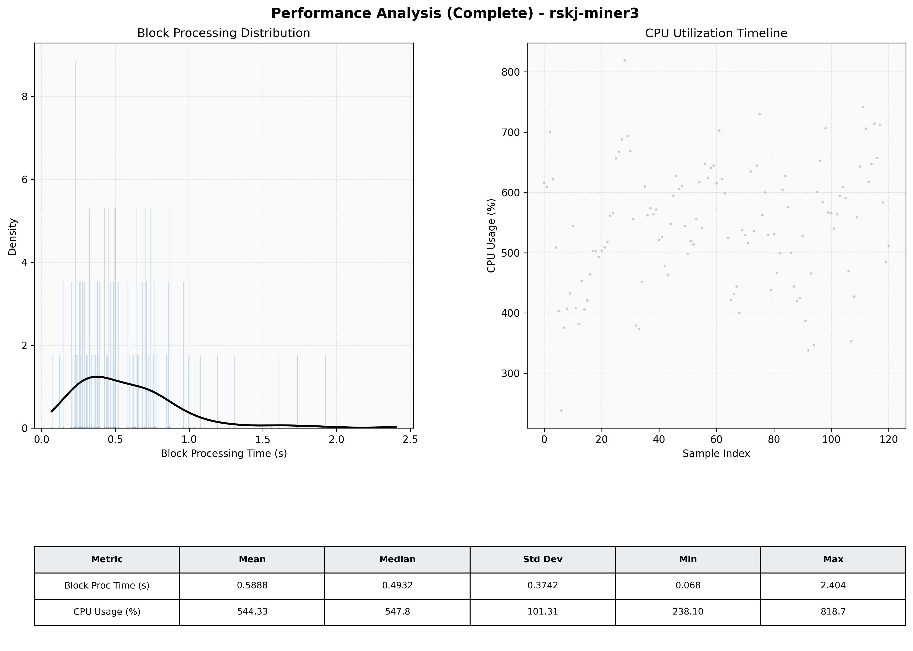

# Miner3 Quantitative Performance Report

| Category | Metric | Unit | Mean | Median | Min | Max |
| :--- | :--- | :--- | :--- | :--- | :--- | :--- |
| Processing | Block Processing Time | s | 0.589 | 0.493 | 0.068 | 2.404 |
|  | BlockExecution JMX | s | 0.433 | 0.294 | 0.096 | 5.124 |
| | Gas Consumed (per block) | M units | 20.37 | 24.06 | 1.86 | 24.93 |
| Resources | CPU Usage per Container | % | 544.33 | 547.81 | 238.10 | 818.71 |
|  | Memory Usage per Container | MiB | 4057.9 | 4073.2 | 3876.2 | 4096.0 |
| | CPU & Memory Assigned | - | 2.0 CPU, 4G | - | - | - |
| JVM | JVM Heap Used | MiB | 2124.5 | 2109.3 | 1344.4 | 2712.7 |
| | JVM Heap Allocated | MiB | 3072.0 | 3072.0 | 3072.0 | 3072.0 |
| JVM GC | GC Copy Time | s | N/A | N/A | N/A | N/A |
| JVM GC | GC MarkSweep Time | s | N/A | N/A | N/A | N/A |
| Disk I/O | Disk Read | MiB/s | 0.001 | 0.000 | 0.000 | 0.008 |
|  | Disk Write | MiB/s | 0.002 | 0.001 | 0.000 | 0.011 |
| Network | Received Network Traffic per Container | KiB/s | 352.43 | 317.90 | 5.12 | 1076.84 |
|  | Sent Network Traffic per Container | KiB/s | 370.35 | 329.66 | 12.62 | 1080.36 |

