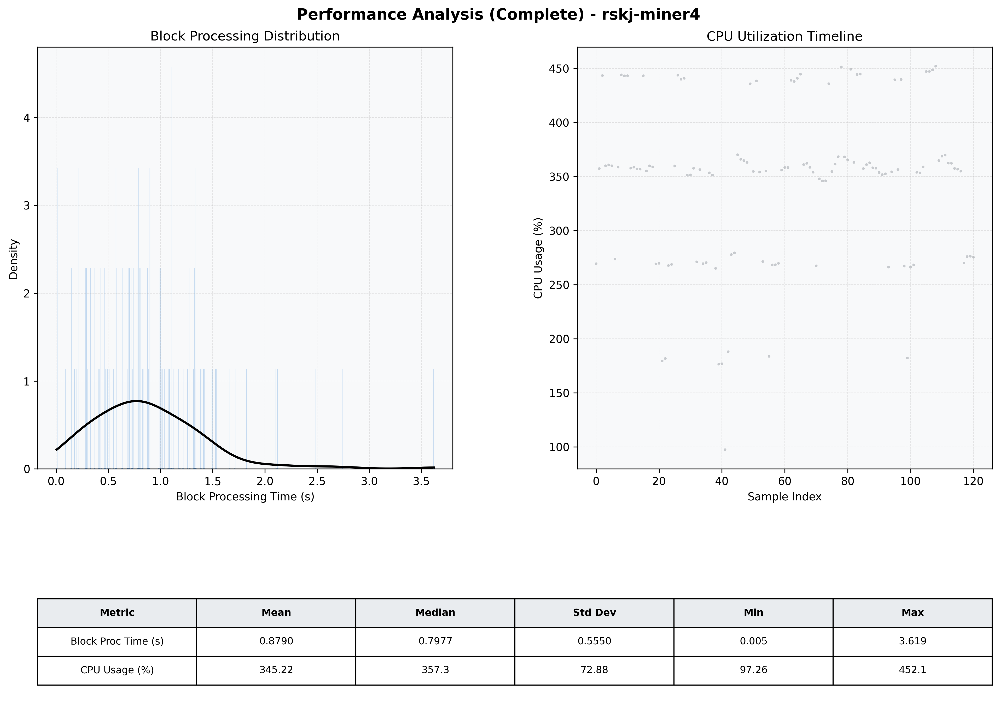

# Miner4 Quantitative Performance Report

| Category | Metric | Unit | Mean | Median | Min | Max |
| :--- | :--- | :--- | :--- | :--- | :--- | :--- |
| Processing | Block Processing Time | s | 0.879 | 0.798 | 0.005 | 3.619 |
|  | BlockExecution JMX | s | 0.472 | 0.412 | 0.083 | 1.703 |
| | Gas Consumed (per block) | M units | 20.37 | 24.06 | 1.86 | 24.93 |
| Resources | CPU Usage per Container | % | 345.22 | 357.35 | 97.26 | 452.07 |
|  | Memory Usage per Container | MiB | 4045.9 | 4053.5 | 3885.0 | 4096.0 |
| | CPU & Memory Assigned | - | 1.0 CPU, 4G | - | - | - |
| JVM | JVM Heap Used | MiB | 2278.6 | 2297.1 | 1619.7 | 2829.3 |
| | JVM Heap Allocated | MiB | 2969.6 | 2969.6 | 2969.6 | 2969.6 |
| JVM GC | GC Copy Time | s | 0.0257 | 0.0241 | 0.009 | 0.054 |
| JVM GC | GC MarkSweep Time | s | 0.0142 | 0.0000 | 0.000 | 0.539 |
| Disk I/O | Disk Read | MiB/s | 464.642 | 67.862 | 0.000 | 8433.642 |
|  | Disk Write | MiB/s | 0.001 | 0.001 | 0.000 | 0.008 |
| Network | Received Network Traffic per Container | KiB/s | 360.53 | 344.57 | 2.63 | 1140.88 |
|  | Sent Network Traffic per Container | KiB/s | 372.52 | 344.13 | 1.50 | 1096.48 |

