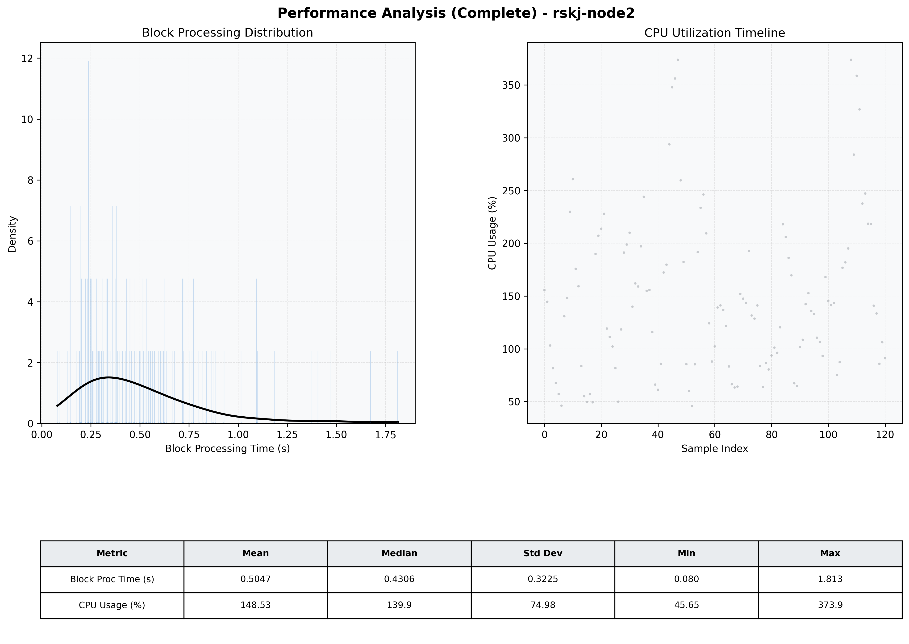

# Node2 Quantitative Performance Report

| Category | Metric | Unit | Mean | Median | Min | Max |
| :--- | :--- | :--- | :--- | :--- | :--- | :--- |
| Processing | Block Processing Time | s | 0.505 | 0.431 | 0.080 | 1.813 |
|  | BlockExecution JMX | s | 0.361 | 0.282 | 0.068 | 1.349 |
| | Gas Consumed (per block) | M units | 20.37 | 24.06 | 1.86 | 24.93 |
| Resources | CPU Usage per Container | % | 148.53 | 139.93 | 45.65 | 373.92 |
|  | Memory Usage per Container | MiB | 4055.4 | 4073.5 | 3934.0 | 4095.9 |
| | CPU & Memory Assigned | - | 2.0 CPU, 4G | - | - | - |
| JVM | JVM Heap Used | MiB | 1795.7 | 1758.8 | 1186.2 | 2780.8 |
| | JVM Heap Allocated | MiB | 3072.0 | 3072.0 | 3072.0 | 3072.0 |
| JVM GC | GC Copy Time | s | N/A | N/A | N/A | N/A |
| JVM GC | GC MarkSweep Time | s | N/A | N/A | N/A | N/A |
| Disk I/O | Disk Read | MiB/s | 330.986 | 68.407 | 0.000 | 8165.523 |
|  | Disk Write | MiB/s | 589.800 | 83.034 | 1.517 | 12655.150 |
| Network | Received Network Traffic per Container | KiB/s | 401.76 | 368.79 | 3.37 | 1141.43 |
|  | Sent Network Traffic per Container | KiB/s | 321.72 | 265.82 | 11.21 | 890.33 |

