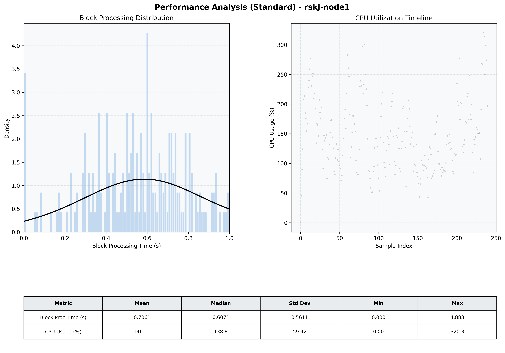

# Node1 Quantitative Performance Report

| Category | Metric | Unit | Mean | Median | Min | Max |
| :--- | :--- | :--- | :--- | :--- | :--- | :--- |
| Processing | Block Processing Time | s | 0.706 | 0.607 | 0.000 | 4.883 |
|  | BlockExecution JMX | s | 0.452 | 0.419 | 0.034 | 0.996 |
| | Gas Consumed (per block) | M units | 21.14 | 24.32 | 0.00 | 24.93 |
| Resources | CPU Usage per Container | % | 146.11 | 138.76 | 0.00 | 320.31 |
|  | Memory Usage per Container | MiB | 2980.6 | 3076.2 | 582.6 | 4095.4 |
| | CPU & Memory Assigned | - | 1.0 CPU, 4G | - | - | - |
| JVM | JVM Heap Used | MiB | 1508.5 | 1624.8 | 159.5 | 2730.6 |
| | JVM Heap Allocated | MiB | 2969.6 | 2969.6 | 2969.6 | 2969.6 |
| JVM GC | GC Copy Time | s | 0.0166 | 0.0146 | 0.000 | 0.069 |
| JVM GC | GC MarkSweep Time | s | 0.0000 | 0.0000 | 0.000 | 0.003 |
| Disk I/O | Disk Read | MiB/s | 0.509 | 0.000 | 0.000 | 78.753 |
|  | Disk Write | MiB/s | 484.089 | 97.940 | 0.000 | 10133.048 |
| Network | Received Network Traffic per Container | KiB/s | 401.21 | 342.64 | 0.00 | 990.96 |
|  | Sent Network Traffic per Container | KiB/s | 380.66 | 344.99 | 0.00 | 1352.65 |

