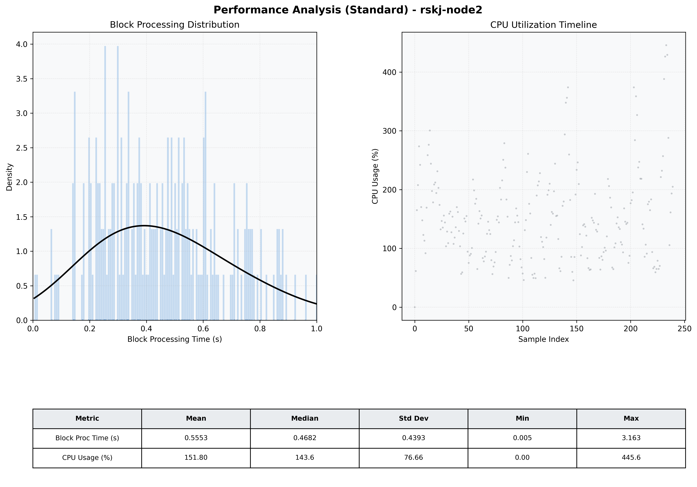

# Node2 Quantitative Performance Report

| Category | Metric | Unit | Mean | Median | Min | Max |
| :--- | :--- | :--- | :--- | :--- | :--- | :--- |
| Processing | Block Processing Time | s | 0.555 | 0.468 | 0.005 | 3.163 |
|  | BlockExecution JMX | s | 0.359 | 0.325 | 0.000 | 0.930 |
| | Gas Consumed (per block) | M units | 21.14 | 24.32 | 0.00 | 24.93 |
| Resources | CPU Usage per Container | % | 151.80 | 143.59 | 0.00 | 445.61 |
|  | Memory Usage per Container | MiB | 3725.0 | 3983.7 | 612.6 | 4095.9 |
| | CPU & Memory Assigned | - | 2.0 CPU, 4G | - | - | - |
| JVM | JVM Heap Used | MiB | 1518.7 | 1618.0 | 51.5 | 2886.8 |
| | JVM Heap Allocated | MiB | 3072.0 | 3072.0 | 3072.0 | 3072.0 |
| JVM GC | GC Copy Time | s | N/A | N/A | N/A | N/A |
| JVM GC | GC MarkSweep Time | s | N/A | N/A | N/A | N/A |
| Disk I/O | Disk Read | MiB/s | 187.043 | 0.759 | 0.000 | 8165.241 |
|  | Disk Write | MiB/s | 519.930 | 102.693 | 0.000 | 12654.713 |
| Network | Received Network Traffic per Container | KiB/s | 435.38 | 395.95 | 0.00 | 1212.24 |
|  | Sent Network Traffic per Container | KiB/s | 347.96 | 305.42 | 0.00 | 1017.68 |

