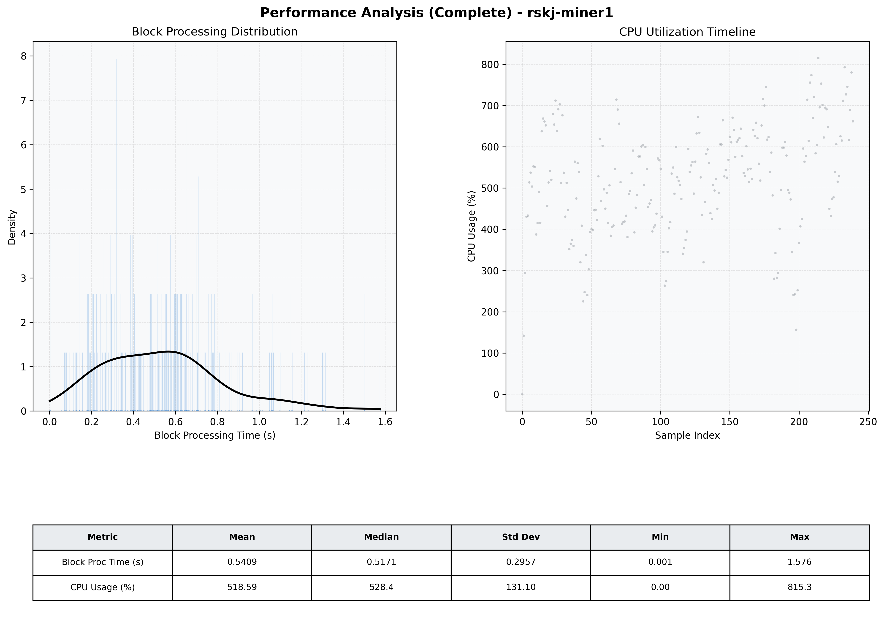

# Miner1 Quantitative Performance Report

| Category | Metric | Unit | Mean | Median | Min | Max |
| :--- | :--- | :--- | :--- | :--- | :--- | :--- |
| Processing | Block Processing Time | s | 0.541 | 0.517 | 0.001 | 1.576 |
|  | BlockExecution JMX | s | 0.309 | 0.282 | 0.027 | 1.088 |
| | Gas Consumed (per block) | M units | 21.14 | 24.32 | 0.00 | 24.93 |
| Resources | CPU Usage per Container | % | 518.59 | 528.36 | 0.00 | 815.26 |
|  | Memory Usage per Container | MiB | 4796.9 | 4745.7 | 784.1 | 6115.6 |
| | CPU & Memory Assigned | - | 2.0 CPU, 8G | - | - | - |
| JVM | JVM Heap Used | MiB | 1990.8 | 2069.3 | 94.0 | 2791.6 |
| | JVM Heap Allocated | MiB | 3072.0 | 3072.0 | 3072.0 | 3072.0 |
| JVM GC | GC Copy Time | s | N/A | N/A | N/A | N/A |
| JVM GC | GC MarkSweep Time | s | N/A | N/A | N/A | N/A |
| Disk I/O | Disk Read | MiB/s | 0.055 | 0.000 | 0.000 | 4.552 |
|  | Disk Write | MiB/s | 0.001 | 0.001 | 0.000 | 0.010 |
| Network | Received Network Traffic per Container | KiB/s | 383.62 | 356.10 | 0.00 | 1034.57 |
|  | Sent Network Traffic per Container | KiB/s | 413.80 | 377.21 | 0.00 | 1245.79 |

