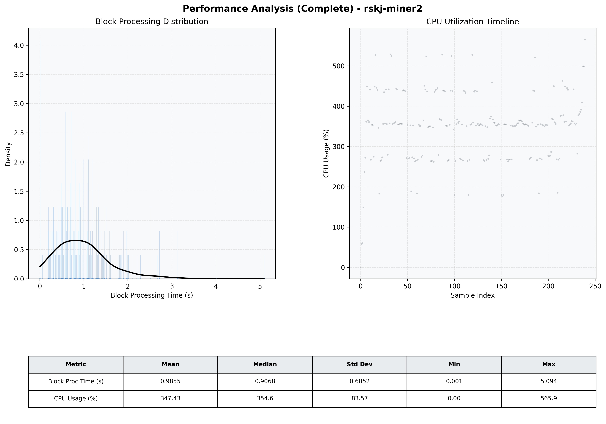

# Miner2 Quantitative Performance Report

| Category | Metric | Unit | Mean | Median | Min | Max |
| :--- | :--- | :--- | :--- | :--- | :--- | :--- |
| Processing | Block Processing Time | s | 0.985 | 0.907 | 0.001 | 5.094 |
|  | BlockExecution JMX | s | 0.592 | 0.409 | 0.013 | 27.215 |
| | Gas Consumed (per block) | M units | 21.14 | 24.32 | 0.00 | 24.93 |
| Resources | CPU Usage per Container | % | 347.43 | 354.60 | 0.00 | 565.90 |
|  | Memory Usage per Container | MiB | 3491.0 | 4003.8 | 637.8 | 4096.0 |
| | CPU & Memory Assigned | - | 1.0 CPU, 4G | - | - | - |
| JVM | JVM Heap Used | MiB | 1817.8 | 1961.1 | 99.4 | 2831.9 |
| | JVM Heap Allocated | MiB | 2969.6 | 2969.6 | 2969.6 | 2969.6 |
| JVM GC | GC Copy Time | s | 0.0269 | 0.0266 | 0.000 | 0.066 |
| JVM GC | GC MarkSweep Time | s | 0.0108 | 0.0000 | 0.000 | 0.507 |
| Disk I/O | Disk Read | MiB/s | 386.882 | 0.136 | 0.000 | 7757.342 |
|  | Disk Write | MiB/s | 0.001 | 0.001 | 0.000 | 0.011 |
| Network | Received Network Traffic per Container | KiB/s | 414.09 | 363.61 | 0.00 | 1312.34 |
|  | Sent Network Traffic per Container | KiB/s | 380.89 | 345.44 | 0.00 | 1157.10 |

