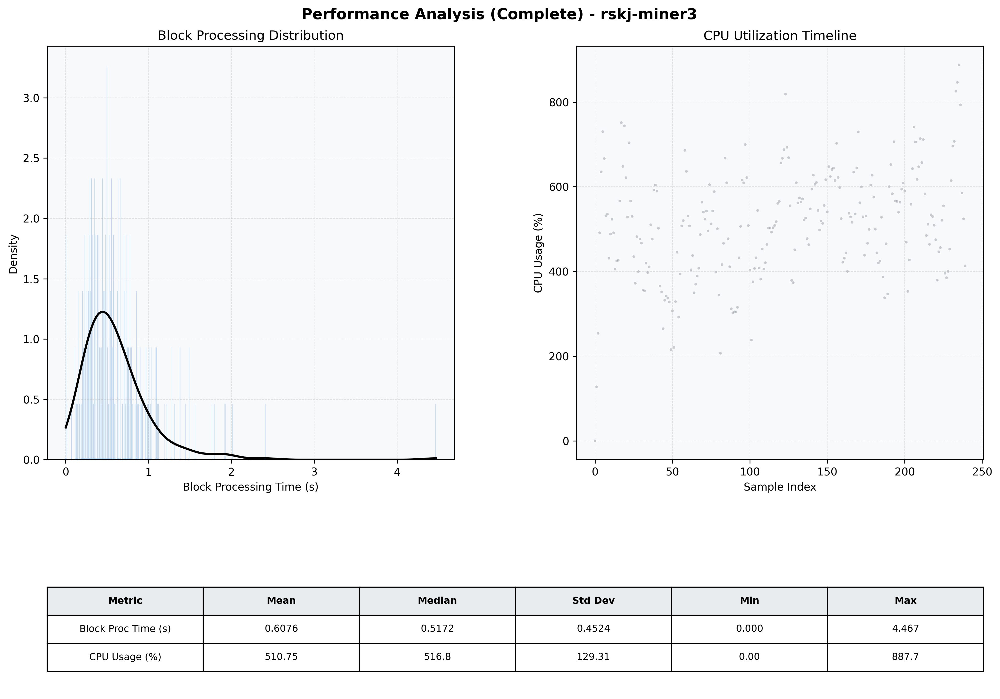

# Miner3 Quantitative Performance Report

| Category | Metric | Unit | Mean | Median | Min | Max |
| :--- | :--- | :--- | :--- | :--- | :--- | :--- |
| Processing | Block Processing Time | s | 0.608 | 0.517 | 0.000 | 4.467 |
|  | BlockExecution JMX | s | 0.404 | 0.287 | 0.007 | 5.124 |
| | Gas Consumed (per block) | M units | 21.14 | 24.32 | 0.00 | 24.93 |
| Resources | CPU Usage per Container | % | 510.75 | 516.82 | 0.00 | 887.75 |
|  | Memory Usage per Container | MiB | 3894.3 | 4041.2 | 609.3 | 4096.0 |
| | CPU & Memory Assigned | - | 2.0 CPU, 4G | - | - | - |
| JVM | JVM Heap Used | MiB | 1945.3 | 2047.4 | 65.1 | 2743.3 |
| | JVM Heap Allocated | MiB | 3072.0 | 3072.0 | 3072.0 | 3072.0 |
| JVM GC | GC Copy Time | s | N/A | N/A | N/A | N/A |
| JVM GC | GC MarkSweep Time | s | N/A | N/A | N/A | N/A |
| Disk I/O | Disk Read | MiB/s | 716.527 | 136.352 | 0.000 | 8554.621 |
|  | Disk Write | MiB/s | 0.002 | 0.001 | 0.000 | 0.011 |
| Network | Received Network Traffic per Container | KiB/s | 379.93 | 333.73 | 0.00 | 1076.84 |
|  | Sent Network Traffic per Container | KiB/s | 417.55 | 361.54 | 0.00 | 1107.44 |

