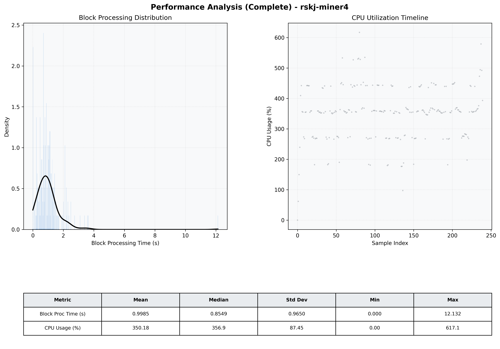

# Miner4 Quantitative Performance Report

| Category | Metric | Unit | Mean | Median | Min | Max |
| :--- | :--- | :--- | :--- | :--- | :--- | :--- |
| Processing | Block Processing Time | s | 0.998 | 0.855 | 0.000 | 12.132 |
|  | BlockExecution JMX | s | 0.571 | 0.445 | 0.058 | 11.730 |
| | Gas Consumed (per block) | M units | 21.14 | 24.32 | 0.00 | 24.93 |
| Resources | CPU Usage per Container | % | 350.18 | 356.86 | 0.00 | 617.05 |
|  | Memory Usage per Container | MiB | 3532.4 | 4004.2 | 564.8 | 4096.0 |
| | CPU & Memory Assigned | - | 1.0 CPU, 4G | - | - | - |
| JVM | JVM Heap Used | MiB | 1840.1 | 2041.8 | 175.9 | 2824.6 |
| | JVM Heap Allocated | MiB | 2969.6 | 2969.6 | 2969.6 | 2969.6 |
| JVM GC | GC Copy Time | s | 0.0267 | 0.0245 | 0.000 | 0.099 |
| JVM GC | GC MarkSweep Time | s | 0.0118 | 0.0000 | 0.000 | 0.637 |
| Disk I/O | Disk Read | MiB/s | 301.725 | 0.138 | 0.000 | 8433.356 |
|  | Disk Write | MiB/s | 0.001 | 0.001 | 0.000 | 0.008 |
| Network | Received Network Traffic per Container | KiB/s | 401.53 | 366.77 | 0.00 | 1179.04 |
|  | Sent Network Traffic per Container | KiB/s | 396.33 | 355.69 | 0.00 | 1096.48 |

