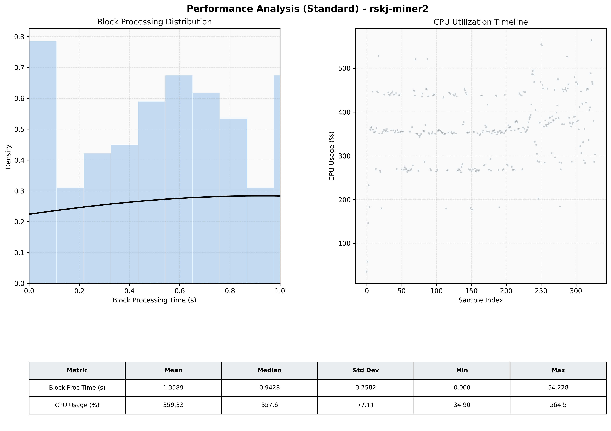

# Miner2 Quantitative Performance Report

| Category | Metric | Unit | Mean | Median | Min | Max |
| :--- | :--- | :--- | :--- | :--- | :--- | :--- |
| Processing | Block Processing Time | s | 1.359 | 0.943 | 0.000 | 54.228 |
|  | BlockExecution JMX | s | 0.420 | 0.399 | 0.033 | 0.994 |
| | Gas Consumed (per block) | M units | 20.38 | 24.00 | 0.00 | 24.94 |
| Resources | CPU Usage per Container | % | 359.33 | 357.57 | 34.90 | 564.48 |
|  | Memory Usage per Container | MiB | 3651.4 | 4049.9 | 780.2 | 4096.0 |
| | CPU & Memory Assigned | - | 1.0 CPU, 4G | - | - | - |
| JVM | JVM Heap Used | MiB | 1925.8 | 2094.3 | 152.9 | 2939.9 |
| | JVM Heap Allocated | MiB | 2969.6 | 2969.6 | 2969.6 | 2969.6 |
| JVM GC | GC Copy Time | s | 0.0298 | 0.0269 | 0.000 | 0.098 |
| JVM GC | GC MarkSweep Time | s | 0.0355 | 0.0000 | 0.000 | 0.694 |
| Disk I/O | Disk Read | MiB/s | 690.199 | 87.651 | 0.000 | 14231.342 |
|  | Disk Write | MiB/s | 0.001 | 0.001 | 0.000 | 0.022 |
| Network | Received Network Traffic per Container | KiB/s | 400.21 | 379.63 | 1.15 | 1340.36 |
|  | Sent Network Traffic per Container | KiB/s | 350.08 | 330.48 | 0.15 | 1079.99 |

