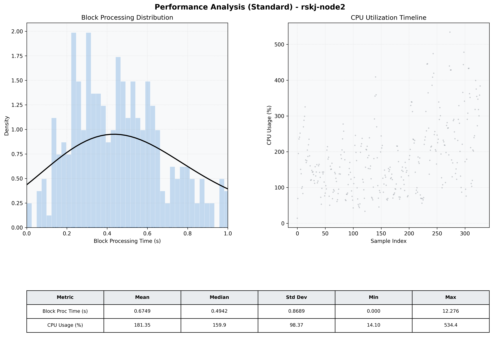

# Node2 Quantitative Performance Report

| Category | Metric | Unit | Mean | Median | Min | Max |
| :--- | :--- | :--- | :--- | :--- | :--- | :--- |
| Processing | Block Processing Time | s | 0.675 | 0.494 | 0.000 | 12.276 |
|  | BlockExecution JMX | s | 0.356 | 0.320 | 0.000 | 0.962 |
| | Gas Consumed (per block) | M units | 20.38 | 24.00 | 0.00 | 24.94 |
| Resources | CPU Usage per Container | % | 181.35 | 159.88 | 14.10 | 534.37 |
|  | Memory Usage per Container | MiB | 3807.1 | 3995.8 | 675.1 | 4096.0 |
| | CPU & Memory Assigned | - | 2.0 CPU, 4G | - | - | - |
| JVM | JVM Heap Used | MiB | 1647.5 | 1809.7 | 128.2 | 2722.8 |
| | JVM Heap Allocated | MiB | 3072.0 | 3072.0 | 3072.0 | 3072.0 |
| JVM GC | GC Copy Time | s | N/A | N/A | N/A | N/A |
| JVM GC | GC MarkSweep Time | s | N/A | N/A | N/A | N/A |
| Disk I/O | Disk Read | MiB/s | 286.110 | 40.138 | 0.000 | 14481.103 |
|  | Disk Write | MiB/s | 607.145 | 96.624 | 0.000 | 22683.862 |
| Network | Received Network Traffic per Container | KiB/s | 410.88 | 378.85 | 0.69 | 1183.52 |
|  | Sent Network Traffic per Container | KiB/s | 342.21 | 317.27 | 4.32 | 1013.41 |

