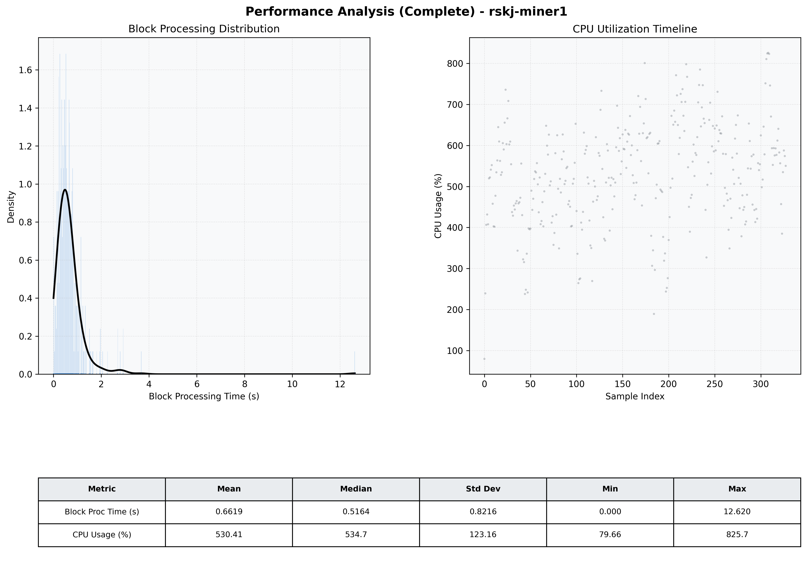

# Miner1 Quantitative Performance Report

| Category | Metric | Unit | Mean | Median | Min | Max |
| :--- | :--- | :--- | :--- | :--- | :--- | :--- |
| Processing | Block Processing Time | s | 0.662 | 0.516 | 0.000 | 12.620 |
|  | BlockExecution JMX | s | 0.355 | 0.279 | 0.023 | 3.173 |
| | Gas Consumed (per block) | M units | 20.38 | 24.00 | 0.00 | 24.94 |
| Resources | CPU Usage per Container | % | 530.41 | 534.71 | 79.66 | 825.69 |
|  | Memory Usage per Container | MiB | 5125.4 | 5370.4 | 784.5 | 6594.5 |
| | CPU & Memory Assigned | - | 2.0 CPU, 8G | - | - | - |
| JVM | JVM Heap Used | MiB | 2094.7 | 2212.3 | 138.3 | 2776.8 |
| | JVM Heap Allocated | MiB | 3072.0 | 3072.0 | 3072.0 | 3072.0 |
| JVM GC | GC Copy Time | s | N/A | N/A | N/A | N/A |
| JVM GC | GC MarkSweep Time | s | N/A | N/A | N/A | N/A |
| Disk I/O | Disk Read | MiB/s | 71.582 | 0.000 | 0.000 | 10489.119 |
|  | Disk Write | MiB/s | 0.001 | 0.001 | 0.000 | 0.015 |
| Network | Received Network Traffic per Container | KiB/s | 365.34 | 335.33 | 2.24 | 1055.37 |
|  | Sent Network Traffic per Container | KiB/s | 401.27 | 365.47 | 6.39 | 1198.04 |

