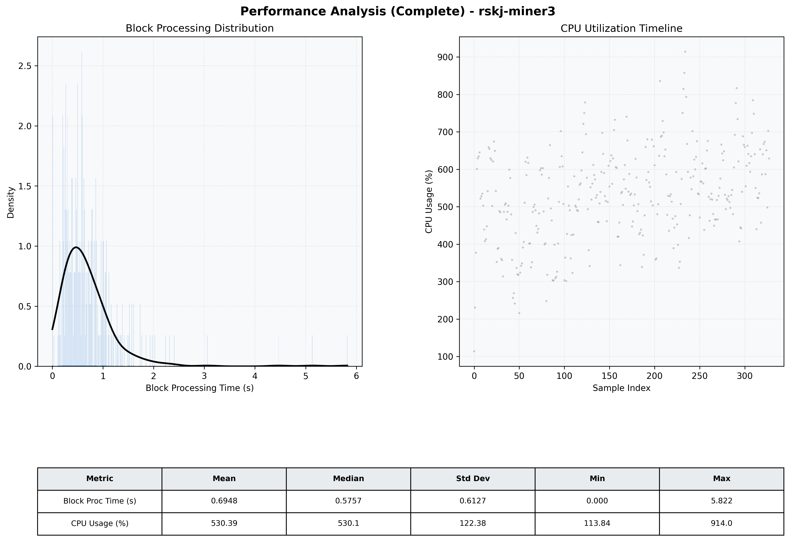

# Miner3 Quantitative Performance Report

| Category | Metric | Unit | Mean | Median | Min | Max |
| :--- | :--- | :--- | :--- | :--- | :--- | :--- |
| Processing | Block Processing Time | s | 0.695 | 0.576 | 0.000 | 5.822 |
|  | BlockExecution JMX | s | 0.474 | 0.300 | 0.012 | 5.124 |
| | Gas Consumed (per block) | M units | 20.38 | 24.00 | 0.00 | 24.94 |
| Resources | CPU Usage per Container | % | 530.39 | 530.14 | 113.84 | 914.01 |
|  | Memory Usage per Container | MiB | 3941.9 | 4050.5 | 687.1 | 4096.0 |
| | CPU & Memory Assigned | - | 2.0 CPU, 4G | - | - | - |
| JVM | JVM Heap Used | MiB | 2053.4 | 2107.4 | 113.6 | 2806.2 |
| | JVM Heap Allocated | MiB | 3072.0 | 3072.0 | 3072.0 | 3072.0 |
| JVM GC | GC Copy Time | s | N/A | N/A | N/A | N/A |
| JVM GC | GC MarkSweep Time | s | N/A | N/A | N/A | N/A |
| Disk I/O | Disk Read | MiB/s | 925.524 | 248.267 | 0.000 | 14711.916 |
|  | Disk Write | MiB/s | 0.002 | 0.001 | 0.000 | 0.022 |
| Network | Received Network Traffic per Container | KiB/s | 364.04 | 328.85 | 1.05 | 1085.28 |
|  | Sent Network Traffic per Container | KiB/s | 404.43 | 370.61 | 4.63 | 1198.68 |

