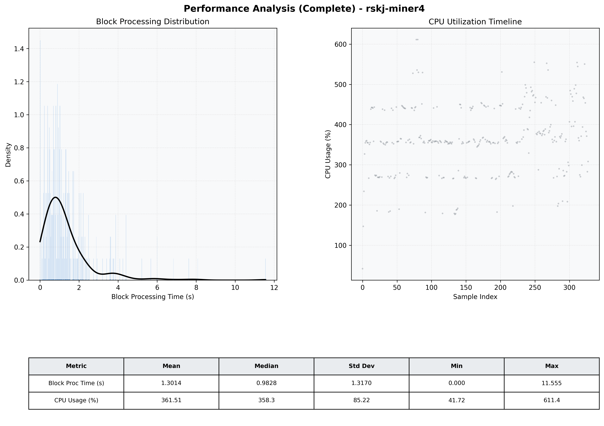

# Miner4 Quantitative Performance Report

| Category | Metric | Unit | Mean | Median | Min | Max |
| :--- | :--- | :--- | :--- | :--- | :--- | :--- |
| Processing | Block Processing Time | s | 1.301 | 0.983 | 0.000 | 11.555 |
|  | BlockExecution JMX | s | 0.867 | 0.480 | 0.083 | 42.475 |
| | Gas Consumed (per block) | M units | 20.38 | 24.00 | 0.00 | 24.94 |
| Resources | CPU Usage per Container | % | 361.51 | 358.31 | 41.72 | 611.38 |
|  | Memory Usage per Container | MiB | 3674.0 | 4024.0 | 654.8 | 4096.5 |
| | CPU & Memory Assigned | - | 1.0 CPU, 4G | - | - | - |
| JVM | JVM Heap Used | MiB | 1966.0 | 2148.3 | 160.8 | 2882.1 |
| | JVM Heap Allocated | MiB | 2969.6 | 2969.6 | 2969.6 | 2969.6 |
| JVM GC | GC Copy Time | s | 0.0309 | 0.0263 | 0.000 | 0.105 |
| JVM GC | GC MarkSweep Time | s | 0.0131 | 0.0000 | 0.000 | 0.745 |
| Disk I/O | Disk Read | MiB/s | 572.336 | 61.381 | 0.000 | 14362.483 |
|  | Disk Write | MiB/s | 0.001 | 0.001 | 0.000 | 0.016 |
| Network | Received Network Traffic per Container | KiB/s | 382.02 | 353.57 | 1.27 | 1258.67 |
|  | Sent Network Traffic per Container | KiB/s | 380.55 | 354.98 | 0.18 | 1190.90 |

