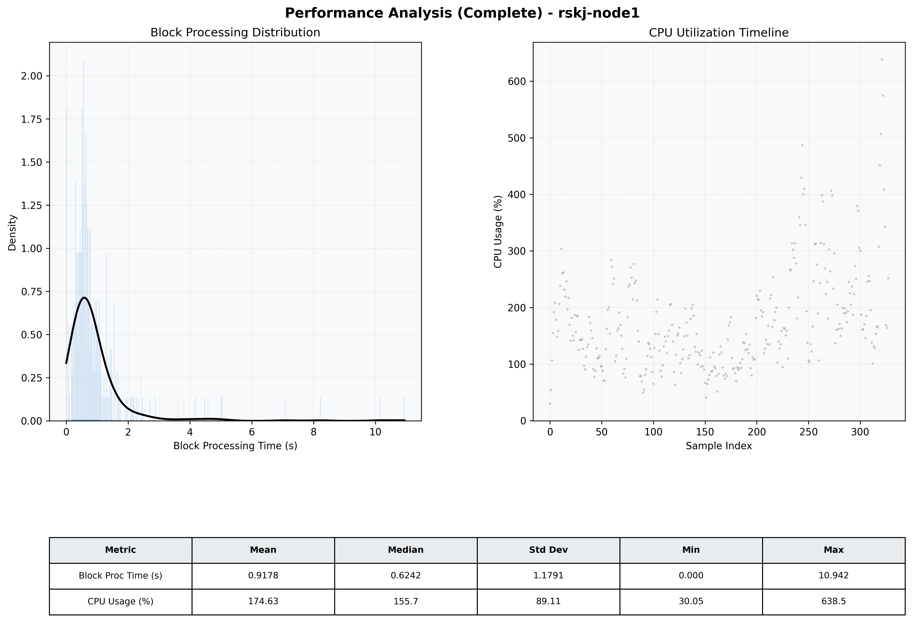

# Node1 Quantitative Performance Report

| Category | Metric | Unit | Mean | Median | Min | Max |
| :--- | :--- | :--- | :--- | :--- | :--- | :--- |
| Processing | Block Processing Time | s | 0.918 | 0.624 | 0.000 | 10.942 |
|  | BlockExecution JMX | s | 0.746 | 0.455 | 0.000 | 11.293 |
| | Gas Consumed (per block) | M units | 20.38 | 24.00 | 0.00 | 24.94 |
| Resources | CPU Usage per Container | % | 174.63 | 155.69 | 30.05 | 638.53 |
|  | Memory Usage per Container | MiB | 3256.8 | 3555.1 | 681.8 | 4095.6 |
| | CPU & Memory Assigned | - | 1.0 CPU, 4G | - | - | - |
| JVM | JVM Heap Used | MiB | 1712.0 | 1809.1 | 135.6 | 2824.4 |
| | JVM Heap Allocated | MiB | 2969.6 | 2969.6 | 2969.6 | 2969.6 |
| JVM GC | GC Copy Time | s | 0.0223 | 0.0172 | 0.000 | 0.104 |
| JVM GC | GC MarkSweep Time | s | 0.0000 | 0.0000 | 0.000 | 0.003 |
| Disk I/O | Disk Read | MiB/s | 159.694 | 0.000 | 0.000 | 12672.116 |
|  | Disk Write | MiB/s | 582.740 | 100.424 | 0.000 | 14843.525 |
| Network | Received Network Traffic per Container | KiB/s | 391.22 | 361.19 | 1.14 | 1302.62 |
|  | Sent Network Traffic per Container | KiB/s | 360.33 | 329.63 | 0.15 | 1251.33 |

