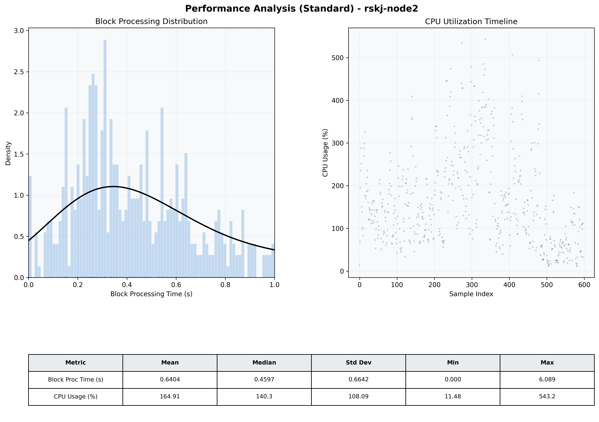

# Node2 Quantitative Performance Report

| Category | Metric | Unit | Mean | Median | Min | Max |
| :--- | :--- | :--- | :--- | :--- | :--- | :--- |
| Processing | Block Processing Time | s | 0.640 | 0.460 | 0.000 | 6.089 |
|  | BlockExecution JMX | s | 0.325 | 0.274 | 0.000 | 0.973 |
| | Gas Consumed (per block) | M units | 20.81 | 24.30 | 0.84 | 24.93 |
| Resources | CPU Usage per Container | % | 164.91 | 140.28 | 11.48 | 543.16 |
|  | Memory Usage per Container | MiB | 3914.7 | 4032.8 | 675.1 | 4096.0 |
| | CPU & Memory Assigned | - | 2.0 CPU, 6G | - | - | - |
| JVM | JVM Heap Used | MiB | 1853.2 | 2000.7 | 20.2 | 2795.9 |
| | JVM Heap Allocated | MiB | 3072.0 | 3072.0 | 3072.0 | 3072.0 |
| JVM GC | GC Copy Time | s | N/A | N/A | N/A | N/A |
| JVM GC | GC MarkSweep Time | s | N/A | N/A | N/A | N/A |
| Disk I/O | Disk Read | MiB/s | 486.879 | 86.759 | 0.000 | 16360.276 |
|  | Disk Write | MiB/s | 706.531 | 81.312 | 0.000 | 22683.080 |
| Network | Received Network Traffic per Container | KiB/s | 320.98 | 263.78 | 0.70 | 1183.56 |
|  | Sent Network Traffic per Container | KiB/s | 248.60 | 204.86 | 4.33 | 1013.45 |

