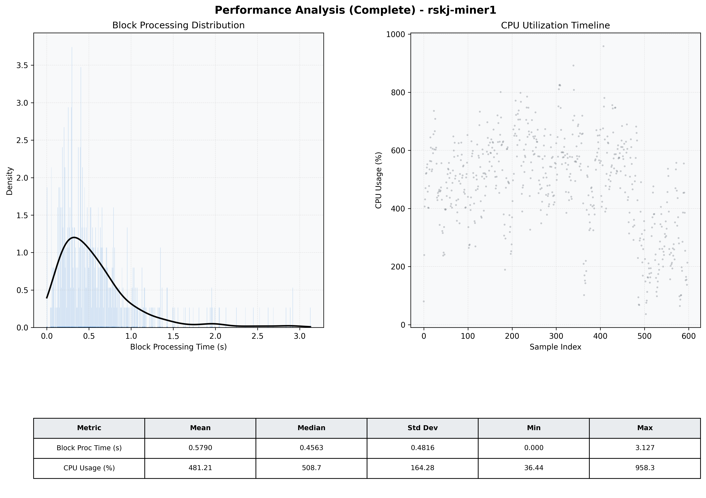

# Miner1 Quantitative Performance Report

| Category | Metric | Unit | Mean | Median | Min | Max |
| :--- | :--- | :--- | :--- | :--- | :--- | :--- |
| Processing | Block Processing Time | s | 0.579 | 0.456 | 0.000 | 3.127 |
|  | BlockExecution JMX | s | 0.348 | 0.248 | 0.019 | 2.735 |
| | Gas Consumed (per block) | M units | 20.81 | 24.30 | 0.84 | 24.93 |
| Resources | CPU Usage per Container | % | 481.21 | 508.69 | 36.44 | 958.34 |
|  | Memory Usage per Container | MiB | 5718.5 | 5919.5 | 784.5 | 7624.5 |
| | CPU & Memory Assigned | - | 4.0 CPU, 8G | - | - | - |
| JVM | JVM Heap Used | MiB | 2149.9 | 2183.1 | 56.2 | 2746.9 |
| | JVM Heap Allocated | MiB | 3072.0 | 3072.0 | 3072.0 | 3072.0 |
| JVM GC | GC Copy Time | s | N/A | N/A | N/A | N/A |
| JVM GC | GC MarkSweep Time | s | N/A | N/A | N/A | N/A |
| Disk I/O | Disk Read | MiB/s | 104.757 | 0.276 | 0.000 | 10488.034 |
|  | Disk Write | MiB/s | 0.001 | 0.001 | 0.000 | 0.017 |
| Network | Received Network Traffic per Container | KiB/s | 270.88 | 220.70 | 2.02 | 1055.41 |
|  | Sent Network Traffic per Container | KiB/s | 314.66 | 274.49 | 6.41 | 1198.12 |

