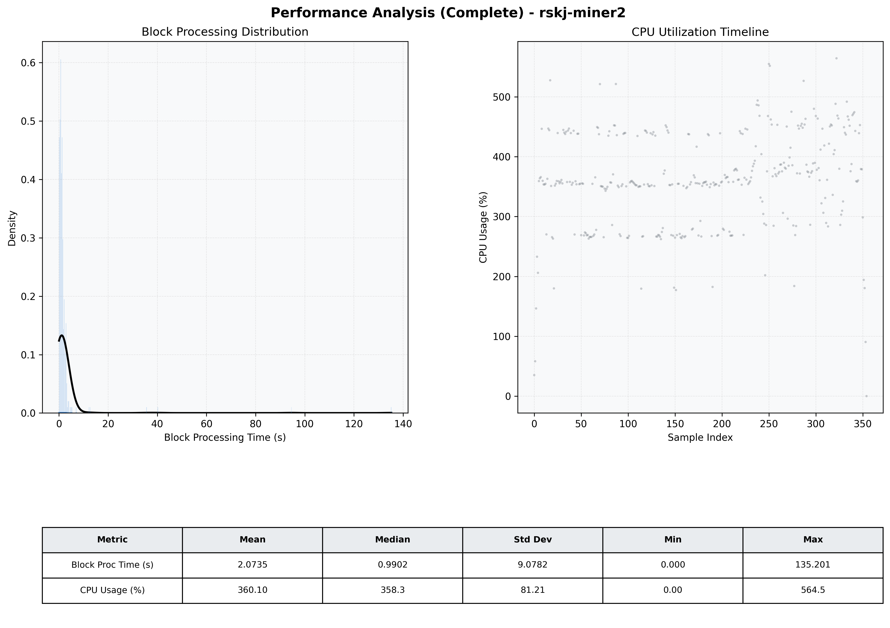

# Miner2 Quantitative Performance Report

| Category | Metric | Unit | Mean | Median | Min | Max |
| :--- | :--- | :--- | :--- | :--- | :--- | :--- |
| Processing | Block Processing Time | s | 2.073 | 0.990 | 0.000 | 135.201 |
|  | BlockExecution JMX | s | 0.607 | 0.435 | 0.000 | 5.843 |
| | Gas Consumed (per block) | M units | 20.81 | 24.30 | 0.84 | 24.93 |
| Resources | CPU Usage per Container | % | 360.10 | 358.27 | 0.00 | 564.49 |
|  | Memory Usage per Container | MiB | 3679.4 | 4055.6 | 780.2 | 4096.0 |
| | CPU & Memory Assigned | - | 4.0 CPU, 8G | - | - | - |
| JVM | JVM Heap Used | MiB | 1926.5 | 2086.9 | 128.6 | 2943.2 |
| | JVM Heap Allocated | MiB | 2969.6 | 2969.6 | 2969.6 | 2969.6 |
| JVM GC | GC Copy Time | s | 0.0307 | 0.0278 | 0.000 | 0.106 |
| JVM GC | GC MarkSweep Time | s | 0.0278 | 0.0000 | 0.000 | 0.762 |
| Disk I/O | Disk Read | MiB/s | 729.198 | 105.936 | 0.000 | 14231.342 |
|  | Disk Write | MiB/s | 0.001 | 0.001 | 0.000 | 0.022 |
| Network | Received Network Traffic per Container | KiB/s | 394.07 | 372.28 | 0.00 | 1340.32 |
|  | Sent Network Traffic per Container | KiB/s | 344.53 | 330.05 | 0.00 | 1079.99 |

